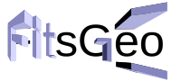

## FitsGeo

**FitsGeo** is a Python package simplifying time consuming part of work related to geometry development in particle transport Monte Carlo code [PHITS](https://phits.jaea.go.jp/), other codes like **MCNP**, **FLUKA** could be added in the future releases. To start MC calculations user need to create so-called input file for **PHITS** code and default way of creation geometry section in this input file may be a bit difficult especially with complicated geometry cases. Also, visualization of created geometry in PHITS is limited to only 2D non-interactive representation which makes process of geometry construction way more difficult. **FitsGeo** simplifies this process, user can define geometry surfaces as Python objects with all coming benefits. Visualization based on [VPython](https://vpython.org/), so all defined surfaces in user geometry is represented in 3D and can be viewed in browser from any side. In addition to surfaces, user can also define materials and cells as objects.

**FitsGeo** provides bunch of modules dedicated to generation of certain sections of PHITS input files. **FitsGeo** works under any operating system --- only Python 3 interpreter with additional modules have to be installed. Very basic skills in programming with Python required. **FitsGeo** package provides bunch of usage examples, therefore, even for the new Python user it will be easy to develop their own geometries for future research.

### Quick installation guide

Install latest Python 3 interpreter and pip tool, then type in console:

    pip install fitsgeo
    
or:

    pip3 install fitsgeo

This command will automatically download package and all dependencies.

### Requirements

Additional modules for FitsGeo use (automatically install via pip tool):

* vpython>=7.6.1
* numpy>=1.16.2
* scipy>=1.2.2
* pandas>=0.25.1

All modules listed in `requirements.txt`.

### Documentation

Please visit [FitsGeo Documentation](https://fitsgeo.readthedocs.io/) for more detailed instructions.
