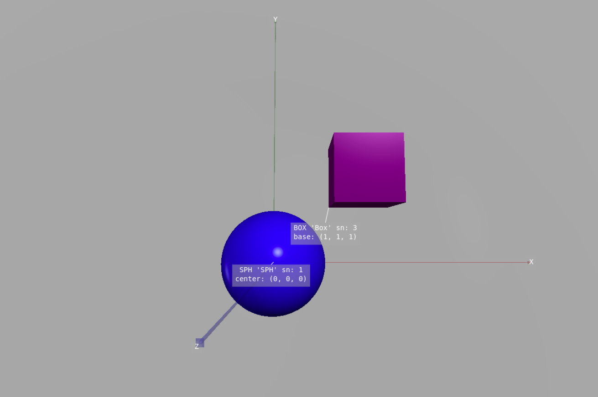
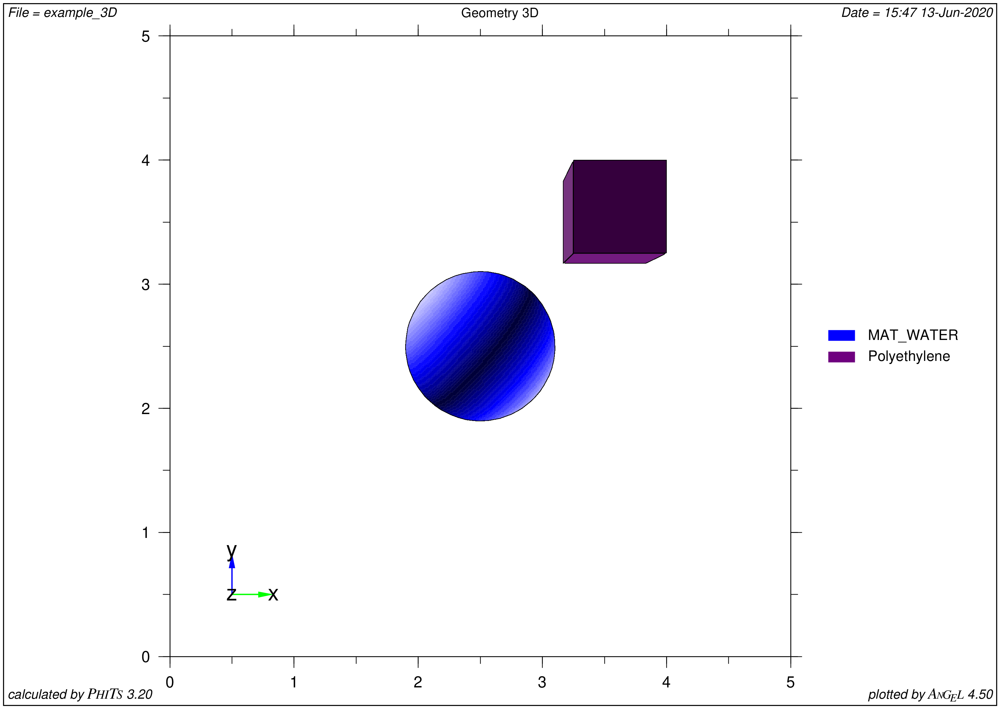

===============
Getting Started
===============

.. rubric:: Brief overview of FitsGeo: how to install and use

Introduction
============

`FitsGeo`_ is a Python package that simplifies the most time-consuming part of the work associated with developing geometry in the Monte Carlo (MC) particle transport code `PHITS`_, other codes such as MCNP, FLUKA, may be added in future releases. To start MC calculations user need to create so-called input file for **PHITS** code and default way of creation geometry section in this input file may be a bit difficult especially with complicated geometry cases. Also, visualization of created geometry in PHITS is limited to only 2D non-interactive representation which makes process of geometry construction way more difficult. **FitsGeo** simplifies this process, user can define geometry surfaces as Python objects with all coming benefits of object-oriented programming paradigm. The part related to visualization in FitsGeo is based on `VPython`_, this way, all defined surfaces in user geometry are represented in 3D and can be viewed in browser from any side interactively. In addition to surfaces, user can also define objects for other sections (materials and cells).

**FitsGeo** provides bunch of modules dedicated to generation of certain sections of PHITS input files. Being Python package, **FitsGeo** works under any operating system --- only Python 3 interpreter with additional modules have to be installed. Very basic skills in programming with Python required to start. **FitsGeo** package provides bunch of usage examples, therefore, even for the new Python user it will be easy to develop their own geometries for future research.

Quick installation guide
========================

Install latest Python 3 interpreter and pip tool, then type in console::

	$ pip install fitsgeo
    
or::

	$ pip3 install fitsgeo

This command will automatically download package and all dependencies. For more detailed installation guide please take a look at `Installation Guide <install.html>`_.

Requirements
============

Additional modules for FitsGeo use (automatically installed via pip tool):

* ``vpython>=7.6.1``
* ``numpy>=1.16.2``
* ``scipy>=1.2.2``
* ``pandas>=0.25.1``

List with all modules in `requirements.txt <https://github.com/GordoNice/fitsgeo/blob/master/requirements.txt>`_.

Using FitsGeo
=============

After package is installed, user need to create his own Python file ``example.py`` and import FitsGeo package::

	import fitsgeo

After that, FitsGeo can be used. To create scene for future geometry type::

	scene = fitsgeo.create_scene()

This will create basic VPython canvas with some default settings, these settings may be configured right when function is called::

	scene = fitsgeo.create_scene(background=fitsgeo.GRAY, ax_length=5)

This will configure background to be gray and axes length equal to 5 cm. Take a look at `User's Guide <user_guide.html>`_ for additional parameters of ``create_scene`` function and for other functions and objects below.

To create materials from predefined databases::

	poly = fitsgeo.Material.database("MAT_POLYETHYLENE", color="purple")
	# ... similar way to create more materials

To use predefined materials user need to be sure that provided material name is in the list. All predefined materials can be listed in console::

	# Prints name of every material from databases
	fitsgeo.list_all_materials()

Also, all predefined materials listed in the `Predefined Materials <material.html>`_ section. Therefore, it is recommended to search suitable materials on this page.

Another way to define material is to create material manually::

	poly = fitsgeo.Material(
		[[0, 6, 2], [0, 1, 4]],
		density=0.94, name="Polyethylene", color="purple")
	# ... similar way to create more materials

In addition to listed materials in databases, FisGeo has 3 predefined in ``material`` module materials::

	# Special material for outer void
	MAT_OUTER = Material([], matn=-1)

	# Special material for void (vacuum)
	MAT_VOID = Material([], matn=0, color="gray")

	# Default material for surfaces and cells
	MAT_WATER = Material.database("MAT_WATER", color="blue")

To create surface objects::

	# Create sphere with default parameters
	sphere = fitsgeo.SPH()

	# Sphere at (0, 0, 0) with R = 5 and predefined void material (for inner/outer boundary)
	outer_sphere = fitsgeo.SPH(
		[0, 0, 0], 5,
		name="Outer", material=fitsgeo.MAT_VOID)

	# Box at (1, 1, 1) base point with side equal to 1 cm and Polyethylene material
	box = fitsgeo.BOX(
		[1, 1, 1], [1, 0, 0], [0, 1, 0], [0, 0, 1],
		name="Box", material=poly)
	# ...

To create cell objects::

	# Outer space definition
	outer_c = fitsgeo.Cell([+outer_sphere], "Outer Void", fitsgeo.MAT_OUTER)

	# Inner part of sphere
	sphere_c = fitsgeo.Cell([-sphere], "Sphere Cell", sphere.material)

	# Inner part of box
	box_c = fitsgeo.Cell([-box], "Box Cell", poly)

	# Cell which contains all surfaces inside
	void_c = fitsgeo.Cell(
		[-outer_sphere + +box + +sphere], "Void Cell", fitsgeo.MAT_VOID)
	# ...

To draw these objects on scene::

	sphere.draw(label_center=True)
	box.draw(label_base=True)
	outer_sphere.draw()
	# ...

Special drawing parameters (e. g. ``label_center``, ``label_base``) may be provided to generate label pointing on the object's center or on the base point.

	**Visualization of geometry in FitsGeo**

Export to PHITS::

	fitsgeo.phits_export()  # Only console output

For saving in file::

	fitsgeo.phits_export(to_file=True, inp_name="example")

Additional flags can be provided to export only certain sections. Take a look at `User's Guide <user_guide.html>`_ for additional flags.

.. toggle-header::
	:header: **Full code for example**

		.. code-block:: python

			import fitsgeo

			# Create scene with some settings
			# scene = fitsgeo.create_scene()
			scene = fitsgeo.create_scene(background=fitsgeo.GRAY, ax_length=5)

			# poly = fitsgeo.Material.database("MAT_POLYETHYLENE", color="purple")
			# To list all materials in databases
			# fitsgeo.list_all_materials()
			
			# To create material manually
			poly = fitsgeo.Material(
					[[0, 6, 2], [0, 1, 4]],
					density=0.94, name="Polyethylene", color="purple")
			# ... create more materials in similar way

			# Access to special material for outer void
			# fitsgeo.MAT_OUTER

			# Access to special material for void (vacuum)
			# fitsgeo.MAT_VOID

			# Access to special material for surfaces and cells
			# fitsgeo.MAT_WATER

			# Create sphere with default parameters
			sphere = fitsgeo.SPH()

			# Sphere at (0, 0, 0) with R = 5 and predefined void material (for inner/outer boundary)
			outer_sphere = fitsgeo.SPH(
				[0, 0, 0], 5, name="Outer", material=fitsgeo.MAT_VOID)

			# Box at (1, 1, 1) base point with side equal to 1 cm and Polyethylene material
			box = fitsgeo.BOX(
				[1, 1, 1], [1, 0, 0], [0, 1, 0], [0, 0, 1], name="Box", material=poly)
			# ...

			# Outer space definition
			outer_c = fitsgeo.Cell([+outer_sphere], "Outer Void", fitsgeo.MAT_OUTER)

			# Inner part of sphere
			sphere_c = fitsgeo.Cell([-sphere], "Sphere Cell", sphere.material)

			# Inner part of box
			box_c = fitsgeo.Cell([-box], "Box Cell", poly)

			# Cell which contains all surfaces inside
			void_c = fitsgeo.Cell(
				[-outer_sphere + +box + +sphere], "Void Cell", fitsgeo.MAT_VOID)
			# ...

			# Draw all surfaces
			sphere.draw(label_center=True)
			box.draw(label_base=True)
			outer_sphere.draw()  # Almost fully transparent
			# ...

			# Export of defined sections to PHITS
			fitsgeo.phits_export(to_file=True, inp_name="example")

That's it! File  ``example_FitsGeo.inp`` is generated in your current directory. Now user can paste created sections from generated file to the PHITS input and visualize geometry using standard ANGEL tool in PHITS.

.. toggle-header::
	:header: **Exported PHITS sections**

		.. code-block:: none

			[ Material ]
			    mat[1] H 2.0 O 1.0  GAS=0 $ name: 'MAT_WATER'
			    mat[2] C 2 H 4  GAS=0 $ name: 'Polyethylene'

			[ Mat Name Color ]
				mat	name	size	color
				1	{MAT\_WATER}	1.00	blue
				2	{Polyethylene}	1.00	purple

			[ Surface ]
			    1   SPH  0.0 0.0 0.0  1.0 $ name: 'SPH' (sphere) x0 y0 z0 R
			    2   SPH  0 0 0  5 $ name: 'Outer' (sphere) x0 y0 z0 R
			    3   BOX  1 1 1  1 0 0  0 1 0  0 0 1 $ name: 'Box' (box, all angles are 90deg) [x0 y0 z0] [Ax Ay Az] [Bx By Bz] [Cx Cy Cz]

			[ Cell ]
			    100 -1  (2) $ name: 'Outer Void' 

			    101 1  1.0  (-1)   $ name: 'Sphere Cell' 
			    102 2  0.94  (-3)   $ name: 'Box Cell' 
			    103 0  (-2 3 1) $ name: 'Void Cell' 

	**Result plotted with ANGEL in PHITS**

For more detailed instructions with more examples please take a look at `User's Guide <user_guide.html>`_.

Features
========

* Great visualization capabilities involving VPython
* Easy geometry setup as Python objects
* Python and the OOP paradigm allow more flexibility while geometry development
* Access to additional properties for every type of defined surface (volume, area, etc)
* Databases with 500+ predefined materials
* Export of defined objects as sections of PHITS input file

Known bugs
==========

- Truncated cone sometimes not stable in visualization, this behaviour will be fixed in the future, use ``truncated=False`` to avoid problem
- Semi-major and semi-minor axes for REC object have only magnitude meaning (direction of these vectors is meaningless)

Future development
==================

Current version is still raw and more features will come in the near future:

* Other sections to PHITS export (source definition, tally definition, etc)
* Export to other codes (MCNP, FLUKA)
* Transformations for objects

Support
=======

Feel free to submit any bugs or suggestions via `issues on GitHub <https://github.com/GordoNice/fitsgeo/issues>`_.

.. _PHITS: https://phits.jaea.go.jp/
.. _FitsGeo: https://github.com/GordoNice/fitsgeo/
.. _VPython: https://vpython.org/
