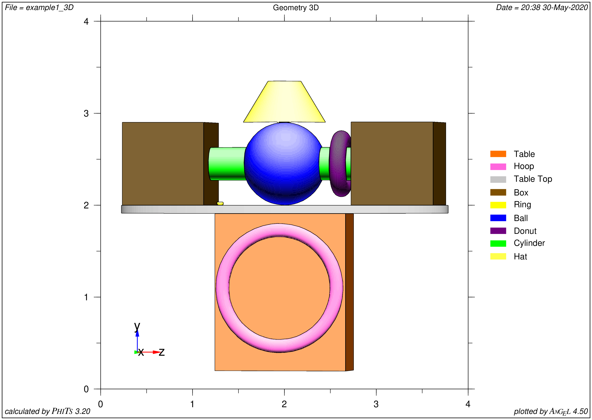
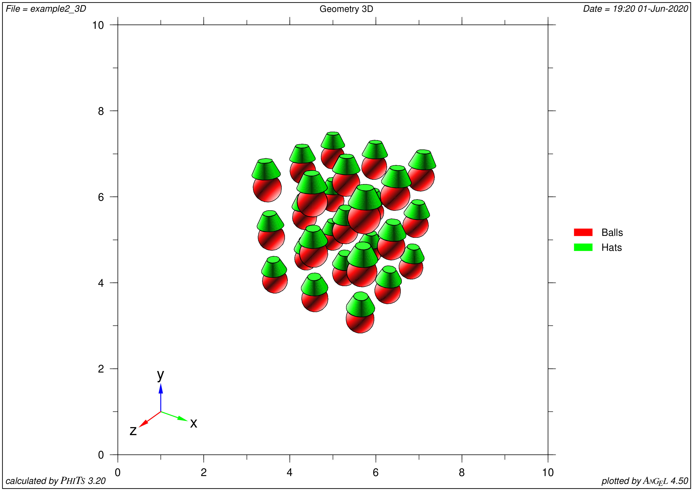
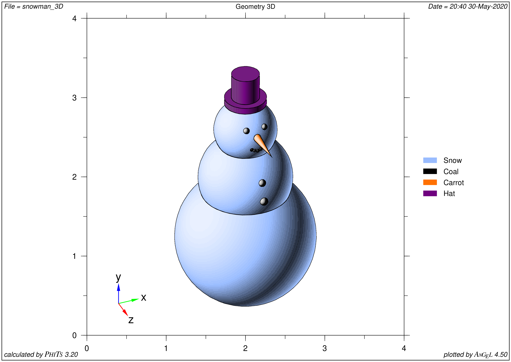

.. highlight:: python

User's Guide
============

Basic example: sphere on box
----------------------------

.. rubric:: Very basic example of how to use

.. todo:: This section not done yet

Example 1: General illustrative example of FitsGeo use
------------------------------------------------------

.. rubric:: Illustrative example of FitsGeo usage. Covers almost all implemented features.

Start::

	import fitsgeo

	fitsgeo.list_all_surfaces()  # Shows all implemented surfaces

	# Create main scene with axis
	ax_l = 5  # Specify axis length
	scene, ax_x, ax_y, ax_z = fitsgeo.create_scene(ax_length=ax_l)

	# Change scene background
	scene.background = fitsgeo.rgb_to_vector(192, 192, 192)

Example 2: Spheres with Hats
----------------------------

.. rubric:: Illustrative example of FitsGeo usage. Shows how to easily create multiple (repeating) objects

Example 3: Snowman
----------------------------

.. rubric:: Illustrative example of FitsGeo usage. General workflow

Advanced
--------

