.. highlight:: python

============
User's Guide
============

.. rubric:: Guide covers almost all features and FitsGeo capabilities with examples

The guide is intended for users who are familiar with the PHITS code. Therefore, many nuances of working with PHITS go beyond of the scope of this FitsGeo documentation. To clarify missing parts please visit `PHIST manual <https://phits.jaea.go.jp/rireki-manuale.html>`_ first. 

Implemented features
====================
.. rubric:: Section describes all current implemented modules with their capabilities and functionality

Currently, FitsGeo package consists of: ``material``, ``const``, ``surface``, ``cell`` and ``export`` modules. Thus, each of them responsable for certain tasks:

* ``material`` handles material definitions, materials can be set from predefined databases or manually (see `Material module <user_guide.html#id1>`_ section)
* ``const`` consists of constants used in FitsGeo: colors for surfaces as VPython vectors and ANGEL (builtin visualization in PHITS) colors associated to these colors (in Python dictionary), $\pi$ definition from NumPy as math constant (see `Const module <user_guide.html#id2>`_ section)
* ``surface`` consists of classes for defining surfaces (see `Surface module <user_guide.html#id4>`_ section)
* ``cell`` consists of class to define cells: more concrete volumes as combinations of surfaces with materials (see `Cell module <user_guide.html#id5>`_ section)
* ``export`` provides functionality for export of all defined objects to PHITS understandable format (other MC codes may be added in the future releases, see `Export module <user_guide.html#id6>`_ section)
  
More modules for other sections of PHITS input will come soon.

Material module
---------------

At first, user need to define materials for his future geometry. Material module have a ``Material`` class, which defines materials for PHTIS [ Material ] section. Parameters, which can be provided for ``Material`` class:

* ``elements: list`` --- elements in [[A1, Z1, Q1], [A2, Z2, Q2], ...] format, where A --- mass number, Z --- atomic number, Q --- quantity of ratio (``"atomic"`` or ``"mass"``)
* ``name: str`` --- name for material object
* ``ratio_type: str = "atomic"`` --- type of ratio: ``"atomic"`` (by default) or ``"mass"``
* ``density: float = 1.0`` --- density for material [g/cm$^3$] (``1.0`` by default)
* ``gas: bool = False`` --- ``True`` if gas (``False`` by default)
* ``color: str`` --- one of colors for material visualization via ANGEL
* ``matn: int`` --- material object number, automatically set after every new material initialization, but can be changed manually after initialization

In addition to this, ``Material`` class has ``database`` class method. This method can be used to define material from databases. Parameters of this method:

* ``name: str`` --- name of material from databases
* ``gas: bool = False`` --- ``True`` if gas (``False`` by default)
* ``color: str`` --- one of colors for material visualization via ANGEL

Thus, any material can be defined in two ways:

1. Using predefined databases
2. Manually

In the first case, the user only needs to specify the name of the desired material and color or gas flag (optionally)::

	water = fitsgeo.Material.database("MAT_WATER", color="blue") 

All available materials with their names and other properties are listed in the `Predefined Materials <material.html>`_ section.

Following second way, user need to provide ``elements`` list and other parameters if needed::

	water = fitsgeo.Material(
		[[0, 1, 2], [0, 8, 1]], name="Water", color="blue")

In this particular example we don't need to additionally set ``ratio_type`` and ``gas`` parameters, because these parameters' default values fit to our needs. But, for example, if we want this to be water vapor::

	water_vapor = fitsgeo.Material(
		[[0, 1, 2], [0, 8, 1]],
		name="Water Vapor", gas=True, color="pastelblue")

Additional ``gas`` flag must be provided.

All colors for materials defined through ``color`` parameter and must be taken as ``ANGEL_COLORS`` dictionary keys (see next section).

If user does not provide any materials for surfaces or cells, ``MAT_WATER`` material is used by default for surfaces and cells. This material, as well as the materials for void and "outer void" are predefined as constants in the ``material`` module::

	# Predefined materials as constants
	MAT_OUTER = Material([], matn=-1)  # Special material for outer void
	MAT_VOID = Material([], matn=0)  # Special material for void
	MAT_WATER = Material.database("MAT_WATER", color="blue")  # Default water

These materials can be invoked directly from ``fitsgeo``::

	fitsgeo.MAT_OUTER
	fitsgeo.MAT_VOID
	fitsgeo.MAT_WATER

All defined materials should be passed as parameters during initialization of surfaces and cells objects. Otherwise, default ``MAT_WATER`` material will be used.

**Question:** *Why do we need to pass materials both to the surface objects and to the cells?*

	**Answer:** in surface objects materials are used for visualization purposes: depending on material properties (``gas``, ``color``) color and opacity for surface draw selected. Cell objects use another properties of material (``matn``, ``density``)

Material module have a global ``created_materials`` list, this list contains all defined materials. This way, all materials could be easily accessed and modified, if needed.

Const module
------------

Const module mainly provides color constants: VPython vectors for VPython surface visualization. ``ANGEL_COLORS`` is a Python dictionary in ``const`` module, this dictionary provides color matching of ANGEL colors (keys in dictionary) to those colors defined through VPython vectors (values in dictionary). In that way, we will have similar colors both in FitsGeo and in PHITS visualization based on ANGEL. Table below shows all available for visualization colors.

.. toggle-header::
	:header: **Table: dictionary with ANGEL and VPython vector colors match**

		.. tabularcolumns:: |p{2.5cm}|p{4cm}|p{3cm}|

		.. table:: **Dictionary with ANGEL and VPython vector colors match**
			:class: longtable

			+---------------+------------------+-----------------+
			| ANGEL         | constant in      | RGB             |
			| color         | ``const`` module | color           |
			+===============+==================+=================+
			| white         | ``WHITE``        | (255, 255, 255) |
			+---------------+------------------+-----------------+
			| lightgray     | ``LIGHTGRAY``    | (211, 211, 211) |
			+---------------+------------------+-----------------+
			| gray          | ``GRAY``         | (169, 169, 169) |
			+---------------+------------------+-----------------+
			| darkgray      | ``DARKGRAY``     | (128, 128, 128) |
			+---------------+------------------+-----------------+
			| matblack      | ``DIMGRAY``      | (105, 105, 105) |
			+---------------+------------------+-----------------+
			| black         | ``BLACK``        | (0, 0, 0)       |
			+---------------+------------------+-----------------+
			| darkred       | ``DARKRED``      | (139, 0, 0)     |
			+---------------+------------------+-----------------+
			| red           | ``RED``          | (255, 0, 0)     |
			+---------------+------------------+-----------------+
			| pink          | ``PINK``         | (219, 112, 147) |
			+---------------+------------------+-----------------+
			| pastelpink    | ``NAVAJOWHITE``  | (255, 222, 173) |
			+---------------+------------------+-----------------+
			| orange        | ``DARKORANGE``   | (255, 140, 0)   |
			+---------------+------------------+-----------------+
			| brown         | ``SADDLEBROWN``  | (139, 69, 19)   |
			+---------------+------------------+-----------------+
			| darkbrown     | ``DARKBROWN``    | (51, 25, 0)     |
			+---------------+------------------+-----------------+
			| pastelbrown   | ``PASTELBROWN``  | (131, 105, 83)  |
			+---------------+------------------+-----------------+
			| orangeyellow  | ``GOLD``         | (255, 215, 0)   |
			+---------------+------------------+-----------------+
			| camel         | ``OLIVE``        | (128, 128, 0)   |
			+---------------+------------------+-----------------+
			| pastelyellow  | ``PASTELYELLOW`` | (255, 255, 153) |
			+---------------+------------------+-----------------+
			| yellow        | ``YELLOW``       | (255, 255, 0)   |
			+---------------+------------------+-----------------+
			| pastelgreen   | ``PASTELGREEN``  | (204, 255, 153) |
			+---------------+------------------+-----------------+
			| yellowgreen   | ``YELLOWGREEN``  | (178, 255, 102) |
			+---------------+------------------+-----------------+
			| green         | ``GREEN``        | (0, 128, 0)     |
			+---------------+------------------+-----------------+
			| darkgreen     | ``DARKGREEN``    | (0, 102, 0)     |
			+---------------+------------------+-----------------+
			| mossgreen     | ``MOSSGREEN``    | (0, 51, 0)      |
			+---------------+------------------+-----------------+
			| bluegreen     | ``BLUEGREEN``    | (0, 255, 128)   |
			+---------------+------------------+-----------------+
			| pastelcyan    | ``PASTELCYAN``   | (153, 255, 255) |
			+---------------+------------------+-----------------+
			| pastelblue    | ``PASTELBLUE``   | (153, 204, 255) |
			+---------------+------------------+-----------------+
			| cyan          | ``CYAN``         | (0, 255, 255)   |
			+---------------+------------------+-----------------+
			| cyanblue      | ``CYANBLUE``     | (0, 102, 102)   |
			+---------------+------------------+-----------------+
			| blue          | ``BLUE``         | (0, 0, 255)     |
			+---------------+------------------+-----------------+
			| violet        | ``DARKVIOLET``   | (238, 130, 238) |
			+---------------+------------------+-----------------+
			| purple        | ``PURPLE``       | (128, 0, 128)   |
			+---------------+------------------+-----------------+
			| magenta       | ``MAGENTA``      | (255, 0, 255)   |
			+---------------+------------------+-----------------+
			| winered       | ``MAROON``       | (128, 0, 0)     |
			+---------------+------------------+-----------------+
			| pastelmagenta | ``VIOLET``       | (238, 130, 238) |
			+---------------+------------------+-----------------+
			| pastelpurple  | ``INDIGO``       | (75, 0, 130)    |
			+---------------+------------------+-----------------+
			| pastelviolet  | ``PASTELVIOLET`` | (204, 153, 255) |
			+---------------+------------------+-----------------+

These colors in **ANGEL color** column are passed as the ``color`` parameter for material objects (see `Material module <user_guide.html#id1>`_ section).

Function ``rgb_to_vector`` in ``const`` module translates RGB colors to VPython vectors::

	VIOLET = rgb_to_vector(238, 130, 238)

This returns ``vpython.vector`` object as ``VIOLET`` color constant, which can be used in VPython visualization. Some more predefined colors can be found in this module.

.. toggle-header::
	:header: **Table: predefined VPython vector colors**

		::

			# Define basic colors as constants
			RED = vpython.color.red
			LIME = vpython.color.green
			BLUE = vpython.color.blue

			BLACK = vpython.color.black
			WHITE = vpython.color.white

			CYAN = vpython.color.cyan
			YELLOW = vpython.color.yellow
			MAGENTA = vpython.color.magenta
			ORANGE = vpython.color.orange

			GAINSBORO = rgb_to_vector(220, 220, 220)
			LIGHTGRAY = rgb_to_vector(211, 211, 211)
			SILVER = rgb_to_vector(192, 192, 192)
			GRAY = rgb_to_vector(169, 169, 169)
			DARKGRAY = rgb_to_vector(128, 128, 128)
			DIMGRAY = rgb_to_vector(105, 105, 105)

			# 6 shades of gray
			GRAY_SCALE = [GAINSBORO, LIGHTGRAY, SILVER, GRAY, DARKGRAY, DIMGRAY]

			GREEN = rgb_to_vector(0, 128, 0)
			OLIVE = rgb_to_vector(128, 128, 0)
			BROWN = rgb_to_vector(139, 69, 19)
			NAVY = rgb_to_vector(0, 0, 128)
			TEAL = rgb_to_vector(0, 128, 128)
			PURPLE = rgb_to_vector(128, 0, 128)
			MAROON = rgb_to_vector(128, 0, 0)
			CRIMSON = rgb_to_vector(220, 20, 60)
			TOMATO = rgb_to_vector(255, 99, 71)
			GOLD = rgb_to_vector(255, 215, 0)
			CHOCOLATE = rgb_to_vector(210, 105, 30)
			PERU = rgb_to_vector(205, 133, 63)
			INDIGO = rgb_to_vector(75, 0, 130)
			KHAKI = rgb_to_vector(240, 230, 140)
			SIENNA = rgb_to_vector(160, 82, 45)
			DARKRED = rgb_to_vector(139, 0, 0)
			PINK = rgb_to_vector(219, 112, 147)
			NAVAJOWHITE = rgb_to_vector(255, 222, 173)
			DARKORANGE = rgb_to_vector(255, 140, 0)
			SADDLEBROWN = rgb_to_vector(139, 69, 19)
			DARKBROWN = rgb_to_vector(51, 25, 0)
			DARKGOLDENROD = rgb_to_vector(184, 134, 11)
			PASTELYELLOW = rgb_to_vector(255, 255, 153)
			PASTELGREEN = rgb_to_vector(204, 255, 153)
			YELLOWGREEN = rgb_to_vector(178, 255, 102)
			DARKGREEN = rgb_to_vector(0, 102, 0)
			MOSSGREEN = rgb_to_vector(0, 51, 0)
			BLUEGREEN = rgb_to_vector(0, 255, 128)
			PASTELCYAN = rgb_to_vector(153, 255, 255)
			PASTELBLUE = rgb_to_vector(153, 204, 255)
			CYANBLUE = rgb_to_vector(0, 102, 102)
			DARKVIOLET = rgb_to_vector(148, 0, 211)
			VIOLET = rgb_to_vector(238, 130, 238)
			PASTELPURPLE = rgb_to_vector(238, 130, 238)
			PASTELVIOLET = rgb_to_vector(204, 153, 255)
			PASTELBROWN = rgb_to_vector(131, 105, 83)

Color for surfaces is set automatically from material. Although, it can be set just before ``draw()`` method execution as::

	# BOX surface, it has MAT_WATER material as parameter be default,
	# which color is "blue"
	box = fitsgeo.BOX()  

	# If we want to change color
	box.color = fitsgeo.YELLOWGREEN

	box.draw()  # This will be YELLOWGREEN, not BLUE

Also, in this module ``PI`` constant defined from NumPy. Another math constants may be defined here in the future.

Surface module
--------------

Firstly, ``surface`` module have ``list_all_surfaces`` function which prints all implemented surfaces in console::

	fitsgeo.list_all_surfaces()

Function ``create_scene()`` creates default VPython canvas with some settings, which can be specified providing additional parameters to function:

* ``axes: bool = True`` --- add axes to scene (``True`` by default)
* ``width: int = 1200`` --- set width for visualization window in browser in pixels (``1200`` pixels by default)
* ``height: int = 800`` --- set height for visualization window in browser in pixels (``800`` pixels by default)
* ``resizable: bool = True`` --- makes window resizable or not (``True`` by default)
* ``ax_length: float = 2.0`` --- axes length, it is better to set as maximum size of the whole geometry (``2.0`` by default)
* ``ax_opacity: float = 0.2`` --- set axes opacity, where ``1.0`` is fully visible and ``0.0`` --- fully transparent (``0.2`` by default)
* ``background: vpython.vector = GRAY_SCALE[1]`` --- set background color for scene (by default it is predefined ``LIGHTGRAY`` color from ``const`` module)
* ``return`` --- ``vpython.canvas`` object

To create empty scene with default settings::

	scene = fitsgeo.create_scene()

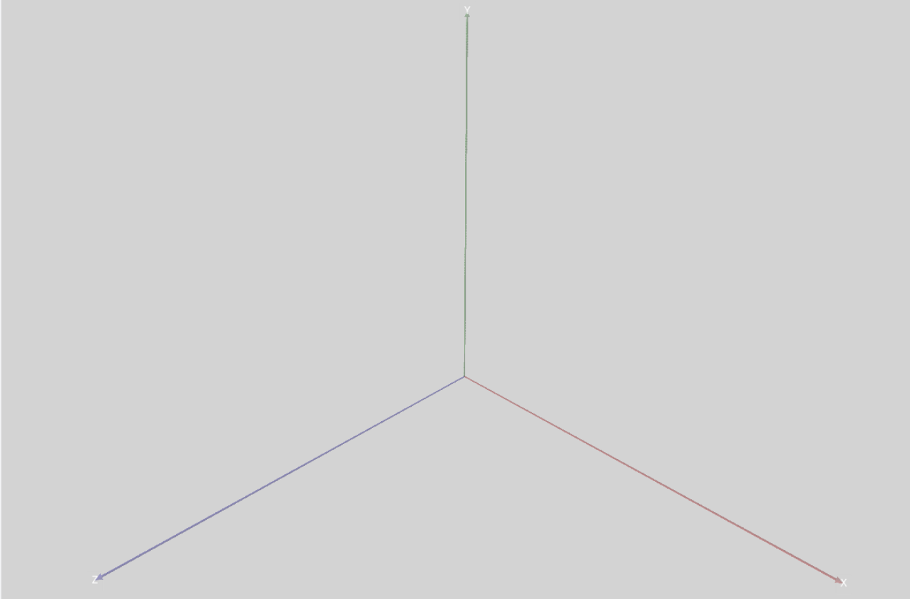

	**Default empty scene with axes**

After that, every created surface will be drawn on this scene. Scene automatically opens in browser.

Control of view:

* **zoom:** mouse wheel
* **rotate:** right mouse button (ctrl+left mouse button)
* **pan:** shift+left mouse button

Scene is a 3D VPython canvas, take a look at `VPython docs <https://www.glowscript.org/docs/VPythonDocs/canvas.html>`_ for more detailed explanation.

To create surfaces, one must create object from corresponding surface class. Table below shows which Python classes for PHITS surfaces are currently implemented. 

.. toggle-header::
	:header: **Table: PHITS surfaces --- FitsGeo classes**

		.. tabularcolumns:: |p{3cm}|p{2cm}|p{7cm}|p{2cm}|

		.. table:: **PHITS surfaces --- FitsGeo classes**
			:class: longtable

			+----------------------+------------+--------------------------+---------------+
			| PHITS surface symbol |  Type      |      Explanation         | Class         |
			|                      |            |                          |               |
			+======================+============+==========================+===============+
			| P                    |            | multi-purpose            |               |
			+----------------------+            +--------------------------+               |
			| PX                   |            | vertical with X-axis     |               |
			+----------------------+            +--------------------------+               |
			| PY                   | planes     | vertical with Y-axis     |      ``P``    |
			+----------------------+            +--------------------------+               |
			| PZ                   |            | vertical with Z-axis     |               |
			+----------------------+------------+--------------------------+---------------+
			| SO                   |            | origin is center         |               |
			+----------------------+            +--------------------------+               |
			| S                    |            | multi-purpose            |               |
			+----------------------+            +--------------------------+               |
			| SX                   | sphere     | center on X-axis         |               |
			+----------------------+            +--------------------------+               |
			| SY                   |            | center on Y-axis         |     ``SPH``   |
			+----------------------+            +--------------------------+               |
			| SZ                   |            | center on Z-axis         |               |
			+----------------------+------------+--------------------------+               |
			| SPH                  | macro body | same as multi-purpose    |               |
			+----------------------+------------+--------------------------+---------------+
			| BOX                  | macro body | optional BOX             |     ``BOX``   |
			+----------------------+------------+--------------------------+---------------+
			|                      | macro body | rectangular solid similar|               |
			| RPP                  |            | to BOX, but each surface |               |
			|                      |            | is vertical with         |     ``RPP``   |
			|                      |            | x, y, z axes             |               |
			+----------------------+------------+--------------------------+---------------+
			| RCC                  | macro body | cylinder                 |     ``RCC``   |
			|                      |            |                          |               |
			+----------------------+------------+--------------------------+---------------+
			| TRC                  | macro body | truncated right-angle    |     ``TRC``   |
			|                      |            | cone                     |               |
			+----------------------+------------+--------------------------+---------------+
			| TX                   |            | parallel with X-axis     |               |
			+----------------------+            +--------------------------+               |
			| TY                   | ellipse    | parallel with Y-axis     |      ``T``    |
			+----------------------+ torus      +--------------------------+               |
			| TZ                   |            | parallel with Z-axis     |               |
			+----------------------+------------+--------------------------+---------------+
			| REC                  | macro body | right elliptical cylinder|     ``REC``   |
			+----------------------+------------+--------------------------+---------------+
			| WED                  | macro body | wedge                    |     ``WED``   |
			+----------------------+------------+--------------------------+---------------+

Therefore, from each class surface objects can be created. For example, to create box surface object of ``BOX`` class::

	box = fitsgeo.BOX([0, 0, 0], [1, 0, 0], [0, 1, 0], [0, 0, 1], name="Box")

This line creates ``box`` object from ``BOX`` class at $P (0, 0, 0)$ (base point) coordinate and $\vec{A} \langle1, 0, 0\rangle$, $\vec{B} \langle0, 1, 0\rangle$, $\vec{C} \langle0, 0, 1\rangle$ vectors from base point with "Box" name.

All classes have default parameters, so, the above object may be simply created as::

	box = fitsgeo.BOX()

Other objects can be created in the same manner. All parameters for all implemented classes listed in the table below.

.. toggle-header::
	:header: **Table: parameters of surface classes**

		.. tabularcolumns:: |p{3cm}|p{3cm}|p{9cm}|

		.. table:: **Parameters of surface classes**
			:class: longtable

			+----------------------+----------------+---------------------------------------------+
			| Class                | Parameter      | Explanation                                 |
			+======================+================+=============================================+
			|                      | ``a: float``   |                                             |
			|                      +----------------+                                             |
			|                      | ``b: float``   |                                             |
			|                      +----------------+ parameters in $Ax + By + Cz - D = 0$        |
			|    ``P``             | ``c: float``   | equation                                    |
			|                      +----------------+                                             |
			|                      | ``d: float``   |                                             |
			|                      +----------------+---------------------------------------------+
			|                      | ``vert: str``  | axis to which plane                         |
			|                      |                | is vertical (``"x"``, ``"y"``, ``"z"``)     |
			+----------------------+----------------+---------------------------------------------+
			|                      | ``xyz0: list`` | center coordinate of                        |
			|                      |                | sphere as [x0, y0, z0] list                 |
			|   ``SPH``            +----------------+---------------------------------------------+
			|                      | ``r: float``   | radius of sphere                            |
			+----------------------+----------------+---------------------------------------------+
			|                      | ``xyz0: list`` | base point coordinate                       |
			|                      |                | as [x0, y0, z0] list                        |
			|                      +----------------+---------------------------------------------+
			|   ``BOX``            | ``a: list``    | vector $\vec{A}$ from base point to         |
			|                      |                | first face as [Ax, Ay, Az] list             |
			|                      +----------------+---------------------------------------------+
			|                      | ``b: list``    | vector $\vec{B}$ from base point to second  |
			|                      |                | face as [Bx, By, Bz] list                   |
			|                      +----------------+---------------------------------------------+
			|                      | ``c: list``    | vector $\vec{C}$ from base point to third   |
			|                      |                | face as [Cx, Cy, Cz] list                   |
			+----------------------+----------------+---------------------------------------------+
			|                      | ``x: list``    | list with x min and max components          |
			|                      |                | as [x_min, x_max] list                      |
			|                      +----------------+---------------------------------------------+
			|  ``RPP``             | ``y: list``    | list with y min and max components          |
			|                      |                | as [y_min, y_max] list                      |
			|                      +----------------+---------------------------------------------+
			|                      | ``z: list``    | list with z min and max components          |
			|                      |                | as [z_min, z_max] list                      |
			+----------------------+----------------+---------------------------------------------+
			|                      | ``xyz0: list`` | center coordinate of bottom face            |
			|                      |                | as [x0, y0, z0] list                        |
			|                      +----------------+---------------------------------------------+
			|  ``RCC``             | ``h: list``    | $\vec{H}$ from the bottom face to the top   |
			|                      |                | as [Hx, Hy, Hz] list                        |
			|                      +----------------+---------------------------------------------+
			|                      | ``r: float``   | radius of bottom face                       |
			+----------------------+----------------+---------------------------------------------+
			|                      | ``xyz0: list`` | center coordinate of cone bottom            |
			|                      |                | face as [x0, y0, z0] list                   |
			|                      +----------------+---------------------------------------------+
			|                      | ``h: list``    | height $\vec{H}$ from center of bottom face |
			|  ``TRC``             |                | to the top face as [Hx, Hy, Hz] list        |
			|                      +----------------+---------------------------------------------+
			|                      | ``r_1: float`` | radius of bottom face of                    |
			|                      |                | truncated cone                              |
			|                      +----------------+---------------------------------------------+
			|                      | ``r_2: float`` | radius of top face of truncated cone        |
			+----------------------+----------------+---------------------------------------------+
			|                      | ``xyz0: list`` | center of the torus                         |
			|                      |                | as [x0, y0, z0] list                        |
			|                      +----------------+---------------------------------------------+
			|                      | ``r: float``   | distance between torus center               |
			|                      |                | (rotational axis) and ellipse center        |
			|                      +----------------+---------------------------------------------+
			|  ``T``               | ``b: float``   | semi-minor axis value                       |
			|                      |                | (ellipse half "height")                     |
			|                      +----------------+---------------------------------------------+
			|                      | ``c: float``   | semi-major axis value                       |
			|                      |                | (ellipse half "width")                      |
			|                      +----------------+---------------------------------------------+
			|                      | ``rot: str``   | rotational axis (``"x"``, ``"y"``, ``"z"``) |
			+----------------------+----------------+---------------------------------------------+
			|                      | ``xyz0: list`` | center coordinate of bottom face            |
			|                      |                | as [x0, y0, z0] list                        |
			|                      +----------------+---------------------------------------------+
			|                      | ``h: list``    | height $\vec{H}$ from center of bottom      |
			|                      |                |                                             |
			|                      |                | face as [Hx, Hy, Hz] list                   |
			|   ``REC``            +----------------+---------------------------------------------+
			|                      | ``a: list``    | semi-major axis $\vec{A}$ of ellipse        |
			|                      |                | orthogonal to $\vec{H}$ as [Ax, Ay, Az] list|
			|                      +----------------+---------------------------------------------+
			|                      | ``b: list``    | semi-minor axis $\vec{B}$ of ellipse        |
			|                      |                | orthogonal to $\vec{H}$ and $\vec{A}$ as    |
			|                      |                | [Bx, By, Bz] list                           |
			+----------------------+----------------+---------------------------------------------+
			|                      | ``xyz0: list`` | base vertex coordinate                      |
			|                      |                | as [x0, y0, z0] list                        |
			|                      +----------------+---------------------------------------------+
			|                      | ``a: list``    | $\vec{A}$ to first side of triangle         |
			|                      |                | as [Ax, Ay, Az] list                        |
			|  ``WED``             +----------------+---------------------------------------------+
			|                      | ``b: list``    | $\vec{B}$ to second side of triangle        |
			|                      |                | as [Bx, By, Bz] list                        |
			|                      +----------------+---------------------------------------------+
			|                      | ``h: list``    | height vector $\vec{H}$ from base vertex    |
			|                      |                | as [Hx, Hy, Hz] list                        |
			+----------------------+----------------+---------------------------------------------+

In addition to listed in the table above parameters, each class have common from ``Surface`` super class parameters/properties:

* ``name: str`` --- name for object, for user convenience, appears in commentaries in PHITS input
* ``trn: str`` --- transform number, specifies the number n of TRn in PHTIS [ Transform ] section (in current version transformations not visualizable)
* ``material: fitsgeo.Material`` --- material associated with surface, object from ``Material`` class, by default predefined ``MAT_WATER`` material is used from ``const`` module
* ``sn: int`` --- surface object number, automatically set after every new surface initialization, but can be changed manually after initialization
* ``color: vpython.vector`` --- ``vpython.vector`` object, which defines color for surface (associated with ANGEL color through ``ANGEL_COLORS`` dictionary from ``const`` module by default), not accessible at initialization
* ``opacity: float`` --- surface opacity during visualization, from ``0.0`` (fully transparent) to ``1.0`` (fully visable), not accessible at initialization

Each class have number of getter/setter methods. They define unique for each class properties in addition to parameters from table above: area surfaces, volumes, diameters etc. All methods are listed in the table below.

.. toggle-header::
	:header: **Table: all methods for surface classes**

		.. tabularcolumns:: |p{1cm}|p{5cm}|p{3cm}|p{6cm}|

		.. table:: **All methods for surface classes**
			:class: longtable

			+----------------------+-------------------------+------------------+-----------------------------------------------+
			| Class                | Method                  | Type             | Explanation                                   |
			+======================+=========================+==================+===============================================+
			|                      | ``diameter``            | Getter & Setter  | Get/set sphere diameter (float)               |
			|   ``SPH``            +-------------------------+------------------+-----------------------------------------------+
			|                      | ``volume``              | Getter & Setter  | Get/set sphere volume (float)                 |
			|                      +-------------------------+------------------+-----------------------------------------------+
			|                      | ``surface_area``        | Getter & Setter  | Get/set full surface area (float)             |
			|                      +-------------------------+------------------+-----------------------------------------------+
			|                      | ``cross_section``       | Getter & Setter  | Get/set cross section area: circle (float)    |
			|                      +-------------------------+------------------+-----------------------------------------------+
			|                      | ``circumference``       | Getter & Setter  | Get/set circumference of cross section (float)|
			+----------------------+-------------------------+------------------+-----------------------------------------------+
			|                      | ``get_center``          | Getter           | Get center of ``BOX`` object as [xc, yc, zc]  |
			|                      +-------------------------+------------------+-----------------------------------------------+
			|                      | ``get_diagonal``        | Getter           | Get diagonal $\vec{D}$ [xd, yd, zd] as list   |
			|                      +-------------------------+------------------+-----------------------------------------------+
			|                      | ``get_diagonal_length`` | Getter           | Get diagonal length $|\vec{D}|$ (float)       |
			|                      +-------------------------+------------------+-----------------------------------------------+
			|     ``BOX``          | ``get_len_a``           | Getter           | Get length of $\vec{A}$ (float)               |
			|                      +-------------------------+------------------+-----------------------------------------------+
			|                      | ``get_len_b``           | Getter           | Get length of $\vec{B}$ (float)               |
			|                      +-------------------------+------------------+-----------------------------------------------+
			|                      | ``get_len_c``           | Getter           | Get length of $\vec{C}$ (float)               |
			|                      +-------------------------+------------------+-----------------------------------------------+
			|                      | ``get_volume``          | Getter           | Get volume of ``BOX`` object (float)          |
			|                      +-------------------------+------------------+-----------------------------------------------+
			|                      | ``get_ab_area``         | Getter           | Get $|\vec{A}\times\vec{B}|$ area (float)     |
			|                      +-------------------------+------------------+-----------------------------------------------+
			|                      | ``get_ac_area``         | Getter           | Get $|\vec{A}\times\vec{C}|$ area (float)     |
			|                      +-------------------------+------------------+-----------------------------------------------+
			|                      | ``get_bc_area``         | Getter           | Get $|\vec{B}\times\vec{C}|$ area (float)     |
			|                      +-------------------------+------------------+-----------------------------------------------+
			|                      | ``get_full_area``       | Getter           | Get full surface area (float)                 |
			+----------------------+-------------------------+------------------+-----------------------------------------------+
			|                      | ``get_width``           | Getter           | Get width of ``RPP`` object (float)           |
			|                      +-------------------------+------------------+-----------------------------------------------+
			|                      | ``get_height``          | Getter           | Get height of ``RPP`` object (float)          |
			|                      +-------------------------+------------------+-----------------------------------------------+
			|     ``RPP``          | ``get_length``          | Getter           | Get length of ``RPP`` object (float)          |
			|                      +-------------------------+------------------+-----------------------------------------------+
			|                      | ``get_center``          | Getter           | Get center as [xc, yc, zc] list               |
			|                      +-------------------------+------------------+-----------------------------------------------+
			|                      | ``get_diagonal_length`` | Getter           | Get diagonal length (float)                   |
			|                      +-------------------------+------------------+-----------------------------------------------+
			|                      | ``get_volume``          | Getter           | Get volume of ``RPP`` object (float)          |
			|                      +-------------------------+------------------+-----------------------------------------------+
			|                      | ``get_wh_area``         | Getter           | Get width $\times$ height face area (float)   |
			|                      +-------------------------+------------------+-----------------------------------------------+
			|                      | ``get_wl_area``         | Getter           | Get width $\times$ length face area (float)   |
			|                      +-------------------------+------------------+-----------------------------------------------+
			|                      | ``get_hl_area``         | Getter           | Get height $\times$ length face area (float)  |
			|                      +-------------------------+------------------+-----------------------------------------------+
			|                      | ``get_full_area``       | Getter           | Get full surface area (float)                 |
			+----------------------+-------------------------+------------------+-----------------------------------------------+
			|                      | ``diameter``            | Getter & Setter  | Get/set bottom/top faces diameter (float)     |
			|                      +-------------------------+------------------+-----------------------------------------------+
			|                      | ``circumference``       | Getter & Setter  | Get/set bottom/top faces circumference (float)|
			|                      +-------------------------+------------------+-----------------------------------------------+
			|                      | ``bottom_area``         | Getter & Setter  | Get/set bottom area of cylinder (float)       |
			|                      +-------------------------+------------------+-----------------------------------------------+
			|                      | ``get_center``          | Getter           | Get center of cylinder as [xc, yc, zc] list   |
			|                      +-------------------------+------------------+-----------------------------------------------+
			|     ``RCC``          | ``get_len_h``           | Getter           | Get height length $|\vec{H}|$ (float)         |
			|                      +-------------------------+------------------+-----------------------------------------------+
			|                      | ``get_volume``          | Getter           | Get volume of ``RCC`` object (float)          |
			|                      +-------------------------+------------------+-----------------------------------------------+
			|                      | ``get_side_area``       | Getter           | Get side surface area (float)                 |
			|                      +-------------------------+------------------+-----------------------------------------------+
			|                      | ``get_full_area``       | Getter           | Get full surface area (float)                 |
			+----------------------+-------------------------+------------------+-----------------------------------------------+
			|                      | ``bottom_diameter``     | Getter & Setter  | Get/set bottom face diameter (float)          |
			|                      +-------------------------+------------------+-----------------------------------------------+
			|                      | ``top_diameter``        | Getter & Setter  | Get/set top face diameter (float)             |
			|                      +-------------------------+------------------+-----------------------------------------------+
			|                      | ``bottom_circumference``| Getter & Setter  | Get/set bottom face circumference (float)     |
			|                      +-------------------------+------------------+-----------------------------------------------+
			|     ``TRC``          | ``top_circumference``   | Getter & Setter  | Get/set top face circumference (float)        |
			|                      +-------------------------+------------------+-----------------------------------------------+
			|                      | ``bottom_area``         | Getter & Setter  | Get/set bottom face area (float)              |
			|                      +-------------------------+------------------+-----------------------------------------------+
			|                      | ``top_area``            | Getter & Setter  | Get/set top face area (float)                 |
			|                      +-------------------------+------------------+-----------------------------------------------+
			|                      | ``get_center``          | Getter           | Get center as [xc, yc, zc] list               |
			|                      +-------------------------+------------------+-----------------------------------------------+
			|                      | ``get_len_h``           | Getter           | Get height $|\vec{H}|$ (float)                |
			|                      +-------------------------+------------------+-----------------------------------------------+
			|                      | ``get_forming``         | Getter           | Get cone forming (float)                      |
			|                      +-------------------------+------------------+-----------------------------------------------+
			|                      | ``get_volume``          | Getter           | Get volume of ``TRC`` object (float)          |
			|                      +-------------------------+------------------+-----------------------------------------------+
			|                      | ``get_side_area``       | Getter           | Get side surface area (float)                 |
			|                      +-------------------------+------------------+-----------------------------------------------+
			|                      | ``get_full_area``       | Getter           | Get full surface area of cone (float)         |
			+----------------------+-------------------------+------------------+-----------------------------------------------+
			|                      | ``circumference``       | Getter & Setter  | Get/set torus circumference (float)           |
			|     ``T``            +-------------------------+------------------+-----------------------------------------------+
			|                      | ``get_cross_section``   | Getter           | Get cross section area of torus (float)       |
			|                      +-------------------------+------------------+-----------------------------------------------+
			|                      | ``get_full_area``       | Getter           | Get full surface area of torus (float)        |
			|                      +-------------------------+------------------+-----------------------------------------------+
			|                      | ``get_volume``          | Getter           | Get volume of torus (float)                   |
			+----------------------+-------------------------+------------------+-----------------------------------------------+
			|                      | ``get_center``          | Getter           | Get center of elliptical cylinder             |
			|                      |                         |                  | as [xc, yc, zc] list                          |
			|                      +-------------------------+------------------+-----------------------------------------------+
			|     ``REC``          | ``get_len_h``           | Getter           | Get height $|\vec{H}|$ (float)                |
			|                      +-------------------------+------------------+-----------------------------------------------+
			|                      | ``get_len_a``           | Getter           | Get semi-major axis length $|\vec{A}|$ (float)|
			|                      +-------------------------+------------------+-----------------------------------------------+
			|                      | ``get_len_b``           | Getter           | Get semi-minor axis length $|\vec{B}|$ (float)|
			|                      +-------------------------+------------------+-----------------------------------------------+
			|                      | ``get_bottom_area``     | Getter           | Get bottom (top) face area                    |
			|                      |                         |                  | of elliptical cylinder (float)                |
			|                      +-------------------------+------------------+-----------------------------------------------+
			|                      | ``get_side_area``       | Getter           | Get side surface area (float)                 |
			|                      +-------------------------+------------------+-----------------------------------------------+
			|                      | ``get_full_area``       | Getter           | Get full surface area (float)                 |
			|                      +-------------------------+------------------+-----------------------------------------------+
			|                      | ``get_volume``          | Getter           | Get volume of elliptical cylinder (float)     |
			+----------------------+-------------------------+------------------+-----------------------------------------------+
			|                      | ``get_center``          | Getter           | Get wedge centroid as [xc, yc, zc] list       |
			|                      +-------------------------+------------------+-----------------------------------------------+
			|                      | ``get_len_a``           | Getter           | Get $|\vec{A}|$ (float)                       |
			|                      +-------------------------+------------------+-----------------------------------------------+
			|                      | ``get_len_b``           | Getter           | Get $|\vec{B}|$ (float)                       |
			|                      +-------------------------+------------------+-----------------------------------------------+
			|     ``WED``          | ``get_len_h``           | Getter           | Get $|\vec{H}|$ (float)                       |
			|                      +-------------------------+------------------+-----------------------------------------------+
			|                      | ``get_len_c``           | Getter           | Get $\sqrt{a^2 + b^2}$ (float),               |
			|                      |                         |                  | where a = $|\vec{A}|$, b = $|\vec{B}|$        |
			|                      +-------------------------+------------------+-----------------------------------------------+
			|                      | ``get_volume``          | Getter           | Get wedge volume (float)                      |
			|                      +-------------------------+------------------+-----------------------------------------------+
			|                      | ``get_ab_area``         | Getter           | Get $|\vec{A}\times\vec{B}|/2$                |
			|                      |                         |                  | bottom/top triangle face area (float)         |
			|                      +-------------------------+------------------+-----------------------------------------------+
			|                      | ``get_ah_area``         | Getter           | Get $|\vec{A}\times\vec{H}|$ face area (float)|
			|                      +-------------------------+------------------+-----------------------------------------------+
			|                      | ``get_bh_area``         | Getter           | Get $|\vec{B}\times\vec{H}|$ face area (float)|
			|                      +-------------------------+------------------+-----------------------------------------------+
			|                      | ``get_ch_area``         | Getter           | Get opposite to $\vec{H}$                     |
			|                      |                         |                  | rectangle face area (float)                   |
			|                      +-------------------------+------------------+-----------------------------------------------+
			|                      | ``get_full_area``       | Getter           | Get full surface area (float)                 |
			+----------------------+-------------------------+------------------+-----------------------------------------------+

Each getter method starts with ``get_`` prefix. If method doesn't have this prefix, then method also has setter.

In addition to listed in the table above methods, each class have common methods:

* ``print_properties()`` --- prints all properties of object in console
* ``phits_print()`` --- returns string with PHITS definition of object
* ``draw()`` --- draws VPython representation of defined object on current scene, additional parameters may be provided to this method:

		* ``size: float`` --- defines size of plane (only for ``P`` class)
		* ``opacity: float`` --- defines surface opacity during visualization, from ``0.0`` (fully transparent) to ``1.0`` (fully visible), **note that** if material parameter ``gas=True``, then opacity will be set to ``0.2`` automatically, planes by default have ``0.2`` opacity
		* ``label: bool`` --- defines whether to show label (text with some description) on **plane surface** during visualization or not
		* ``label_center: bool`` --- defines whether to show label of object's center (except planes) during visualization or not
		* ``label_base: bool`` --- defines whether to show label of object's base point (if object has it) during visualization or not

For example, to print all properties of object in console::

	box.print_properties()

To get PHITS definition of object::

	export_line = box.phits_print()
	print(export_line)   # Print definition in console

To draw box object on scene with labels pointing on box's base point and center::

	box.draw(label_base=True, label_center=True)

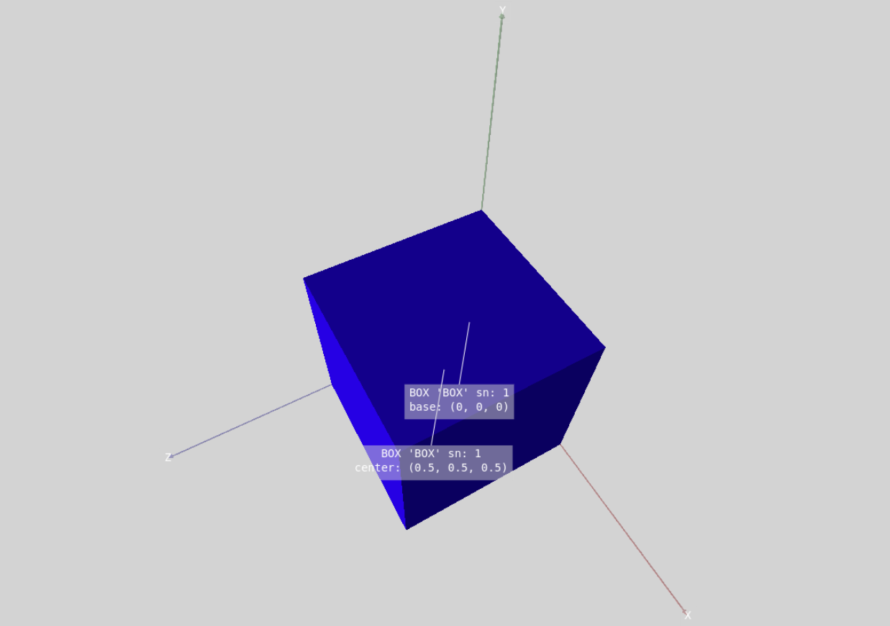

	**Box surface drawn on scene with center and base labels**

To get full surface area of box object::

	area = box.get_full_area

Or, to get volume of box object::

	volume = box.get_volume

To redefine ``xyz0`` parameter of box object::

	box.xyz0 = [1, 2, 3]

To redefine only x component from ``xyz0``::

	box.xyz0[0] = 1

or::

	box.x0 = 1

Similar way can be applied to other objects, using other methods.

In ``SPH`` class all methods represented both as getter and setter methods. This means, that user can define or get any property. For example::

	sphere = fitsgeo.SPH([0, 0, 0], 1)  # Create sphere object from SPH class
	sphere.volume = 1  # Set volume to 1

Last line will make ``r`` (radius) parameter of ``sphere`` correspond to defined volume. Same works for all other methods in ``SPH`` class.

To get value of property::

	volume = sphere.volume  # Get volume of sphere

Similarly, user can redefine radius of sphere according to any other defined property. 

Surface module have a global ``created_surfaces`` list, this list contains all initialized surfaces. This way, all surfaces could be easily accessed from this list and modified, or, for example, drawn all together::

	for surface in created_surfaces:
		surface.draw()

This command will draw all created surfaces.

Cell module
-----------

This module provides ``Cell`` class for cells definition. Example of basic cell::

	box_cell = fitsgeo.Cell(
		[-box], name="Box Cell", material=fitsgeo.MAT_WATER))

Parameters in ``Cell`` class:

* ``cell_def: list`` --- list with regions and the Boolean operators, ``" "`` (blank)(AND), ``":"`` (OR), and ``"#"`` (NOT). Parentheses ``"("`` and ``")"`` will be added automatically for regions
* ``name: str = "Cell"`` --- name for cell object
* ``material: fitsgeo.Material = fitsgeo.MAT_WATER`` --- material associated with cell (predefined ``MAT_WATER`` material by default)
* ``volume: float = None`` --- volume [cm$^3$] of the cell
* ``cn: int`` --- cell object number, automatically set after every new cell initialization, but can be changed manually after initialization (number for cells start from ``100``)

Cells are defined by treating regions divided by surfaces. Surface classes have overloaded ``"+"`` (``__pos__``) and ``"-"`` (``__neg__``) operators, this provides capability to define "surface sense" (see `PHITS manual <https://phits.jaea.go.jp/rireki-manuale.html>`_). These operators return surface numbers of surface objects as strings.

Example::

	print(-box)  # Print string "-sn", where sn is a box.sn
	print(+box)  # Print string "sn", where sn is a box.sn

	region1 = [-box]  # Defines negative sense of box object (inner space)
	region2 = [+box]  # Defines positive sense of box object (outer space)

The symbols ``" "`` (blank), ``":"``, and ``"#"`` denote the intersection (AND), union (OR), and complement (NOT), operators, respectively. Let's say that we have multiple objects (``box`` and ``sphere``) and we want to make cell with union of these surfaces::

	import fitsgeo

	# Create default scene
	fitsgeo.create_scene()

	box = fitsgeo.BOX()  # Box surface
	sphere = fitsgeo.SPH()  # Sphere surface

	# Define outer void cell
	outer_cell = fitsgeo.Cell(
	        [+box, ":", +sphere],
	        material=fitsgeo.MAT_OUTER, name="Outer Void")
	# Define union of objects
	cell = fitsgeo.Cell(
	        [-box, ":", -sphere], name="Union")

	sphere.color = fitsgeo.YELLOW  # Just to make different colors

	# Draw half transparent
	box.draw(opacity=0.5)
	sphere.draw(opacity=0.5)

	fitsgeo.phits_export()  # Export sections to PHITS

The result of visualization in FitsGeo is on the image below.

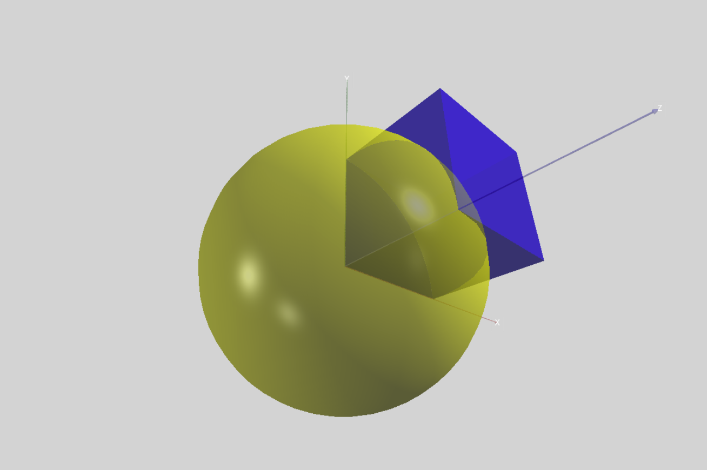

	**Cell as the union of box and sphere (FitsGeo visualization)**

In the FitsGeo visualization we will always see our surfaces, not cells, but after export of generated sections to PHITS and visualization using ANGEL, this will be like on the image below.

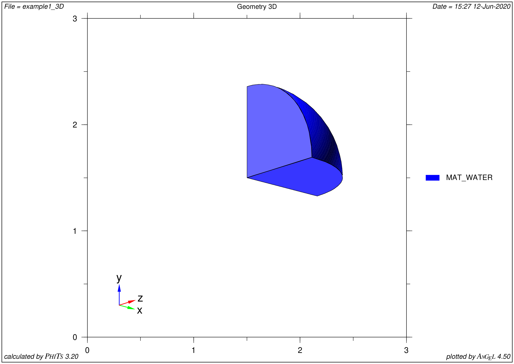

	**Cell as the union of box and sphere (ANGEL visualization)**

Exported sections to PHITS, as well as the full input file are presented below.

.. toggle-header::
	:header: **Exported from FitsGeo PHITS sections**

		.. code-block:: none

			[ Material ]
			    mat[1] H 2.0 O 1.0  GAS=0 $ name: 'MAT_WATER'

			[ Mat Name Color ]
			        mat     name    size    color
			        1       {MAT\_WATER}    1.00    blue

			[ Surface ]
			    1   BOX  0.0 0.0 0.0  1.0 0.0 0.0  0.0 1.0 0.0  0.0 0.0 1.0 $ name: 'BOX' (box, all angles are 90deg) [x0 y0 z0] [Ax Ay Az] [Bx By Bz] [Cx Cy Cz]
			    2   SPH  0.0 0.0 0.0  1.0 $ name: 'SPH' (sphere) x0 y0 z0 R

			[ Cell ]
			    100 -1  (1):(2) $ name: 'Outer Void' 

			    101 1  1.0  (-1):(-2)   $ name: 'Union' 

.. toggle-header::
	:header: **Full PHITS input file**

		.. code-block:: none

			[ Parameters ]
				icntl = 11		# (D=0) 3:ECH 5:ALL VOID 6:SRC 7,8:GSH 11:DSH 12:DUMP

			[ Source ]
				s-type = 2		# mono-energetic rectangular source
				e0 = 1			# energy of beam [MeV]
				proj = proton	# kind of incident particle

			[ Material ]
			    mat[1] H 2.0 O 1.0  GAS=0 $ name: 'MAT_WATER'

			[ Mat Name Color ]
			        mat     name    size    color
			        1       {MAT\_WATER}    1.00    blue

			[ Surface ]
			    1   BOX  0.0 0.0 0.0  1.0 0.0 0.0  0.0 1.0 0.0  0.0 0.0 1.0 $ name: 'BOX' (box, all angles are 90deg) [x0 y0 z0] [Ax Ay Az] [Bx By Bz] [Cx Cy Cz]
			    2   SPH  0.0 0.0 0.0  1.0 $ name: 'SPH' (sphere) x0 y0 z0 R

			[ Cell ]
			    100 -1  (1):(2) $ name: 'Outer Void' 

			    101 1  1.0  (-1):(-2)   $ name: 'Union' 

			[ T-3Dshow ]
				title = Geometry 3D
				x0 = 0
				y0 = 0
				z0 = 0

				w-wdt = 3
				w-hgt = 3
				w-dst = 10

				w-mnw = 400			# Number of meshes in horizontal direction.
				w-mnh = 400			# Number of meshes in vertical direction.
				w-ang = 0

				e-the = -45
				e-phi = 24
				e-dst = 100

				l-the = 80
				l-phi = 140
				l-dst = 200*100

				file = example1_3D
				output = 3			# (D=3) Region boundary + color
				width = 0.5			# (D=0.5) The option defines the line thickness.
				epsout = 1

			[ E n d ]

Or, we can define cells as::

	import fitsgeo

	fitsgeo.create_scene()

	box = fitsgeo.BOX()
	sphere = fitsgeo.SPH()

	# Define outer void
	outer_cell = fitsgeo.Cell(
	        [+box + +sphere],
	        material=fitsgeo.MAT_OUTER, name="Outer Void")
	# Intersection of inner part of box and outer part of sphere
	cell_box = fitsgeo.Cell([-box + +sphere], name="Intersection")
	# Inner part of sphere
	cell_sphere = fitsgeo.Cell(
	        [-sphere],
	        name="Inner Sphere",
	        material=fitsgeo.Material.database("MAT_WATER", color="yellow"))

	sphere.color = fitsgeo.YELLOW  # Just to make different colors

	box.draw(opacity=0.5)
	sphere.draw(opacity=0.5)

	fitsgeo.phits_export()  # Export sections

Three cells are defined: first for outer void, second as the intersection of the inner part of box and outer part of sphere, third as the inner part of sphere. Note that for some other cases for particle transport one more void (or with air material) cell should be defined, which contains all objects inside. See exported to PHITS sections below.

.. toggle-header::
	:header: **Exported from FitsGeo PHITS sections**

		.. code-block:: none

			[ Material ]
			    mat[1] H 2.0 O 1.0  GAS=0 $ name: 'MAT_WATER'
			    mat[2] H 2.0 O 1.0  GAS=0 $ name: 'MAT_WATER'

			[ Mat Name Color ]
			        mat     name    size    color
			        1       {MAT\_WATER}    1.00    blue
			        2       {MAT\_WATER}    1.00    yellow

			[ Surface ]
			    1   BOX  0.0 0.0 0.0  1.0 0.0 0.0  0.0 1.0 0.0  0.0 0.0 1.0 $ name: 'BOX' (box, all angles are 90deg) [x0 y0 z0] [Ax Ay Az] [Bx By Bz] [Cx Cy Cz]
			    2   SPH  0.0 0.0 0.0  1.0 $ name: 'SPH' (sphere) x0 y0 z0 R

			[ Cell ]
			    100 -1  (1 2) $ name: 'Outer Void' 

			    101 1  1.0  (-1 2)   $ name: 'Intersection' 
			    102 2  1.0  (-2)   $ name: 'Inner Sphere' 

.. toggle-header::
	:header: **Full PHITS input file**

		.. code-block:: none

			[ Parameters ]
			    icntl = 11      # (D=0) 3:ECH 5:ALL VOID 6:SRC 7,8:GSH 11:DSH 12:DUMP

			[ Source ]
			    s-type = 2      # mono-energetic rectangular source
			    e0 = 1          # energy of beam [MeV]
			    proj = proton   # kind of incident particle

			[ Material ]
			    mat[1] H 2.0 O 1.0  GAS=0 $ name: 'MAT_WATER'
			    mat[2] H 2.0 O 1.0  GAS=0 $ name: 'MAT_WATER'

			[ Mat Name Color ]
			        mat     name    size    color
			        1       {MAT\_WATER}    1.00    blue
			        2       {MAT\_WATER}    1.00    yellow

			[ Surface ]
			    1   BOX  0.0 0.0 0.0  1.0 0.0 0.0  0.0 1.0 0.0  0.0 0.0 1.0 $ name: 'BOX' (box, all angles are 90deg) [x0 y0 z0] [Ax Ay Az] [Bx By Bz] [Cx Cy Cz]
			    2   SPH  0.0 0.0 0.0  1.0 $ name: 'SPH' (sphere) x0 y0 z0 R

			[ Cell ]
			    100 -1  (1 2) $ name: 'Outer Void' 

			    101 1  1.0  (-1 2)   $ name: 'Intersection' 
			    102 2  1.0  (-2)   $ name: 'Inner Sphere' 

			[ T-3Dshow ]
			    title = Geometry 3D
			    x0 = 0
			    y0 = 0
			    z0 = 0

			    w-wdt = 3
			    w-hgt = 3
			    w-dst = 10

			    w-mnw = 400         # Number of meshes in horizontal direction.
			    w-mnh = 400         # Number of meshes in vertical direction.
			    w-ang = 0

			    e-the = -45
			    e-phi = 24
			    e-dst = 100

			    l-the = 80
			    l-phi = 140
			    l-dst = 200*100

			    file = example_3D
			    output = 3          # (D=3) Region boundary + color
			    width = 0.5         # (D=0.5) The option defines the line thickness.
			    epsout = 1

			[ E n d ]

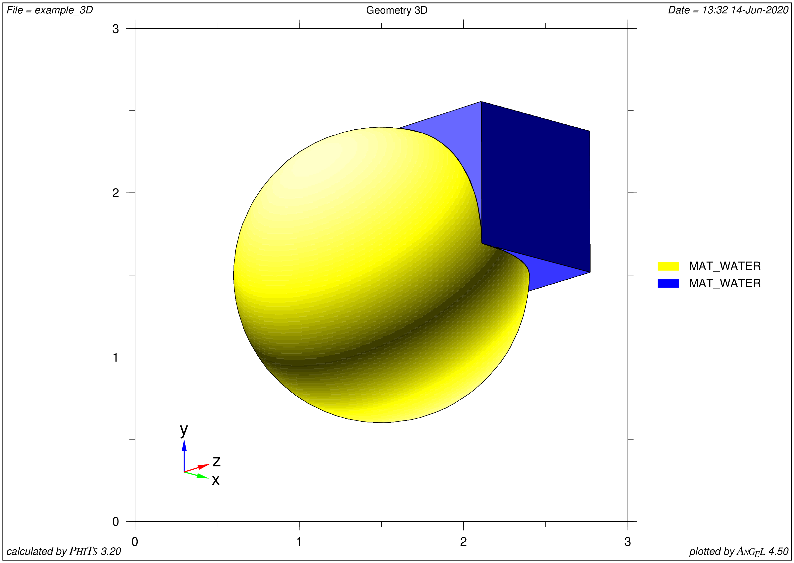

	**Another cells definition (ANGEL visualization)**

Finally, just like ``surface`` and ``material`` modules, ``cell`` module provides ``created_cells`` --- list with all initialized cells in it.

To get this list::

	fitsgeo.created_cells

Export module
-------------

Module provides functions for export of all defined objects to MC code understandable format (only export to PHTIS for now). Example::

	fitsgeo.phits_export()

This will print [ Surface ], [ Cell ] and [ Material ] sections in console (other sections may be exported in future releases). By default all sections are exported in console, but this behaviour may be configured by providing additional parameters:

* ``to_file: bool = False`` --- flag to export sections to the input file (flag ``False`` by default --- only export to console)
* ``inp_name: str = "example"`` --- name for input file export
* ``export_surfaces: bool = True`` --- flag for [ Surface ] section export
* ``export_materials: bool = True`` --- flag for [ Material ] section export
* ``export_cells: bool = True`` --- flag for [ Cell ] section export

Example of exporting sections to input file::

	fitsgeo.phits_export(to_file=True, inp_name="example")

This will export all defined sections in one ``example_FitsGeo.inp`` file. Some sections may be excluded from export::

	fitsgeo.phits_export(to_file=True, inp_name="example", export_materials=False)

This will export only [ Surface ] and [ Cell ] sections.

If some of sections not defined (some of lists with objects are empty) these sections will be skiped and warning notification in console appears. For example, if there are no cells defined notification in console will be:

.. code-block:: none

	No cell is defined!
	created_cells list is empty!

Same for other objects.

Example 0: The Column
=====================

.. rubric:: Illustrative example of FitsGeo usage. Very basic example of how to use FitsGeo

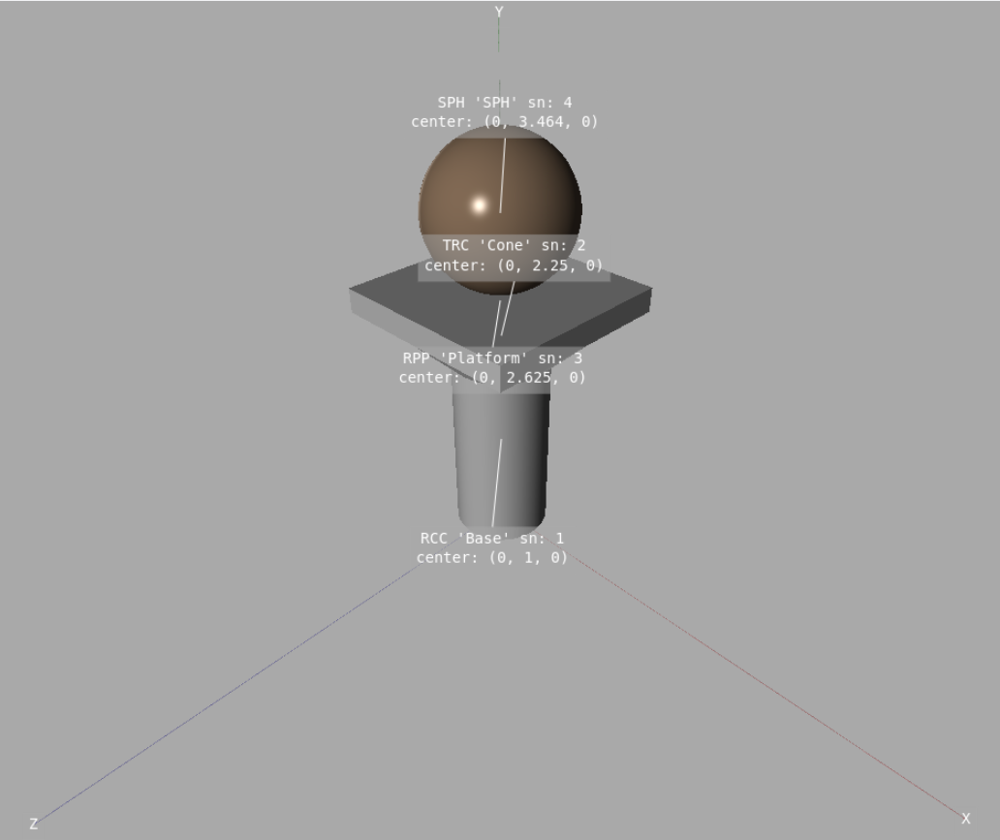

	**Example 0: FitsGeo visualization**

.. toggle-header::
	:header: **Example 0: full FitsGeo code**

	.. literalinclude:: examples/example0.py
		:linenos:
		:language: python		

In this example we will create column as shown on the picture above. The full FitsGeo code for this example is also shown above.

In the begining we need to import FitsGeo:

.. literalinclude:: examples/example0.py
	:lineno-start: 3
	:lines: 3
	:language: python		

Here we import FitsGeo with alias ``fg`` just to make it shorter.

First stage of geometry setup is to understand which materials we will need. In this example we only need 2 materials, which can be easily obtained through the predefined databases:

.. literalinclude:: examples/example0.py
	:lineno-start: 5
	:lines: 5-7
	:language: python

This is concrete for column base and bronze for sphere on top. The main workflow can be as follows: find the desired materials in the `Predefined Materials <material.html>`_ section, see if all properties in the database are ok, and define this material, or if something is not as you would like, define this material manually, or change some property (e.g. density) in predefined material just after initialization.

After that we can create default scene as:

.. literalinclude:: examples/example0.py
	:lineno-start: 9
	:lines: 9
	:language: python

Here we make the axes longer than the ones by default. This line of code can be anywhere, except after lines with the draw method of surfaces. Also, we can just skip this line and not define the scene at all, but in this case we will not be able to change some of the scene properties, and the automatically created scene will have a black background and no axes.

Next part of code defines surfaces for geometry: cylinder, truncated cone and platform for base of column and sphere on top of that: 

.. literalinclude:: examples/example0.py
	:lineno-start: 11
	:lines: 11-23
	:language: python

Here, the advantage of FitsGeo use getting more clear: we don't need to operate with absolute values of every surface. We can just define our "base" surface and place every other surface relatively from it (or from any another surface). Only the ``base`` has absolute values in parameters, the other surfaces are placed and sized relative to other surfaces. For example: base point of ``cone`` set as ``base.h``, base radius of ``cone`` set as radius of ``base`` and so on. In this case, if we change any parameter of ``base`` other surfaces changes accordingly. 

After surfaces are defined, we need to define cells:

.. literalinclude:: examples/example0.py
	:lineno-start: 25
	:lines: 25-31
	:language: python

Here, the advantage is that we operate with names of surfaces, not with surface numbers. This make it more easy to define cells. Also, we can provide volume of cells automatically, without calculation by hand.

Finally, we can draw surfaces and export all objects to PHITS:

.. literalinclude:: examples/example0.py
	:lineno-start: 33
	:lines: 33-38
	:language: python

Here, for every surface object there are labels pointing on centers. VPython visualization allows to look on geometry from every side interactively.

The following figure shows the visualization of the geometry in PHITS (via ANGEL). The full input file for PHITS is also shown below, note that the sections exported from FitsGeo are located under lines **14--37**.

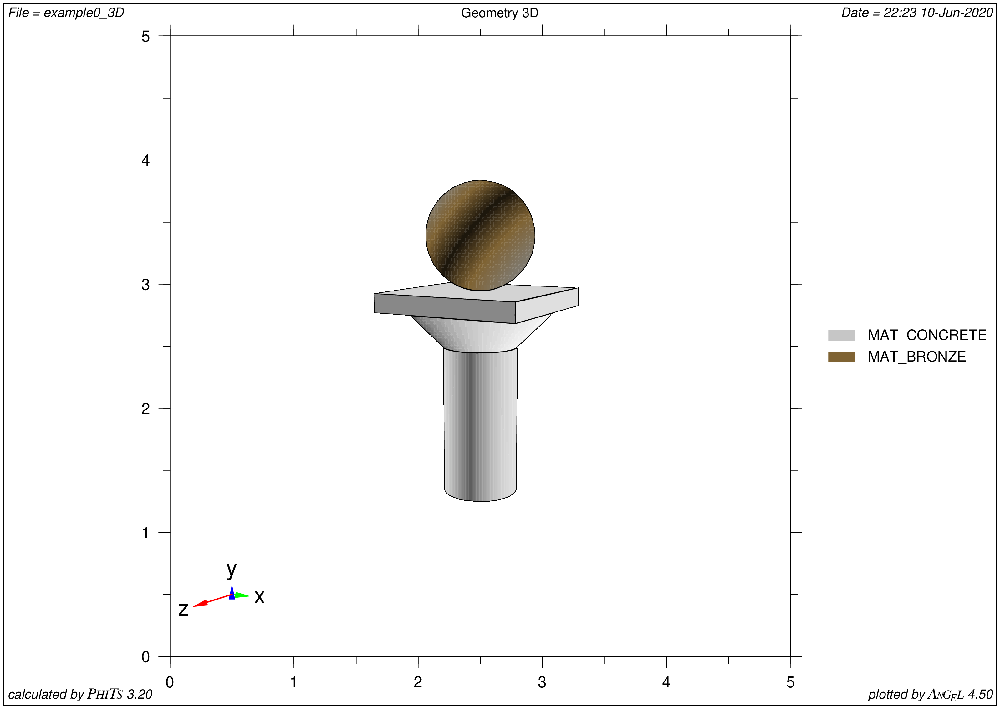

	**Example 0: PHITS visualization**

.. toggle-header::
	:header: **Example 0: PHITS input**

	.. literalinclude:: examples/example0.inp
		:linenos:
		:emphasize-lines: 14-37
		:language: none	

Example 1: general illustrative example of FitsGeo
==================================================

.. rubric:: Illustrative example of FitsGeo usage. Covers all implemented surfaces and features

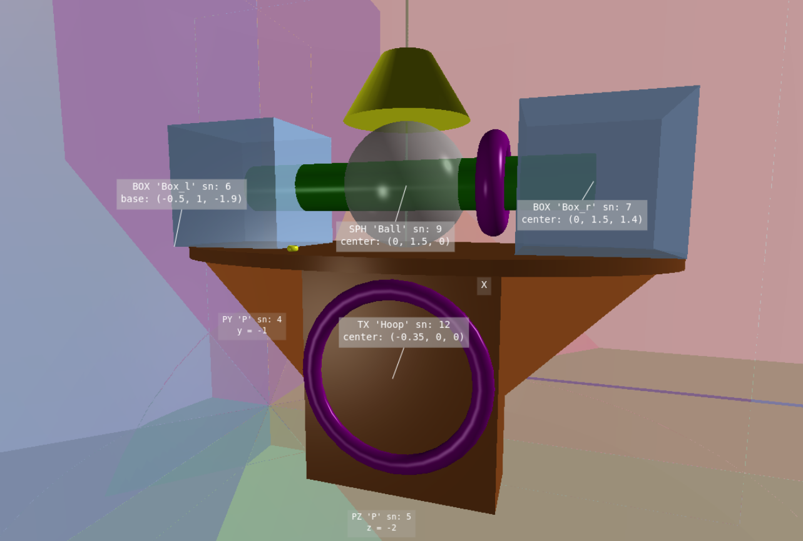

	**Example 1: FitsGeo visualization**

In this example, we can see almost all the implemented features and aspects of work with FitsGeo. The full view on created geometry is shown in the image above. The full FitsGeo code for this example is shown below.

.. toggle-header::
	:header: **Example 1: full FitsGeo code**

	.. literalinclude:: examples/example1.py
		:linenos:
		:language: python

First of all, we need to import FitsGeo:

.. literalinclude:: examples/example1.py
	:lineno-start: 4
	:lines: 4
	:language: python

In line **6**, we call the command to display all implemented surface classes in the console:

The part of the code below shows how to create and configure the scene:

.. literalinclude:: examples/example1.py
	:lineno-start: 8
	:lines: 8-12
	:language: python

Here we use special ``ax_l`` variable for axes length. We can change background of scene through VPython ``background`` parameter. This is a VPython vector with color. For convenience, defined through ``rgb_to_vector`` function with RGB colors.

In the lines **14-23** we define materials for future geometry in two ways: from databases and manually for Polyethylene.

Starting from line **25** we define surfaces. Following part of code defines planes:

.. literalinclude:: examples/example1.py
	:lineno-start: 26
	:lines: 26-30
	:language: python

Here, ``p1`` is a general plane: a plane that is not vertical with axes. ``px1``, ``py1``, ``pz1`` --- special cases of planes vertical with $X$, $Y$ and $Z$ axis accordingly. If we provide ``vert`` parameter with vertical axis, only ``d`` parameter for plane equation has meaning, and other parameters in plane equation can be any. We can also define these special cases only using the general plane, not providing ``vert``. In this example we need planes only for visualization purposes and we don’t use them for cells definitions, but, as any other surface, plane can be used for cells definitions as well. Also, unlike to other surfaces, we don’t need to pass materials to planes, colors are set depending on vertical axis and for general plane it is a mix of colors.

In the lines **32--75** we define surfaces from every class of ``surface`` module of FitsGeo. Every surface has common with other surfaces parameters and specific ones. One more ``void`` surface is defined:

.. literalinclude:: examples/example1.py
	:lineno-start: 77
	:lines: 77-78
	:language: python

We need this surface to contain all our surfaces inside. Later we will assign cell with it (this can be filled with vacuum or air material).

All defined parameters of surfaces can be changed later as it shown on the lines **80--115**. These lines demonstrate how we can easily define new positions or sizes for our objects relative to other objects. This is the advantage of OOP way of geometry creation.

After that, we can draw all surfaces. We can use different approaches for that. Next part of code shows how to draw planes:

.. literalinclude:: examples/example1.py
	:lineno-start: 117
	:lines: 117-119
	:language: python

Because plane have infinite sizes, we need to pass special ``size`` parameter to the ``draw`` method. This parameter limits plane and allows to draw this plane as square (if plane is vertical) or as parallelogram for general case.

We can draw every surface separately as on the code:

.. literalinclude:: examples/example1.py
	:lineno-start: 121
	:lines: 121-125
	:language: python

This is useful if we need to provide some labels to specific surfaces only, or if we need to change opacity levels.

Alternatively, we can define surfaces through for cycle:

.. literalinclude:: examples/example1.py
	:lineno-start: 127
	:lines: 127-129
	:language: python

This works if we don't need to provide additional parameters to the ``draw`` method.

The following image shows another advantage: interactive visualization. We can see even really small parts of created geometry, like the ring on the table. And it is not so easy to obtain using only ANGEL visualization in PHITS.

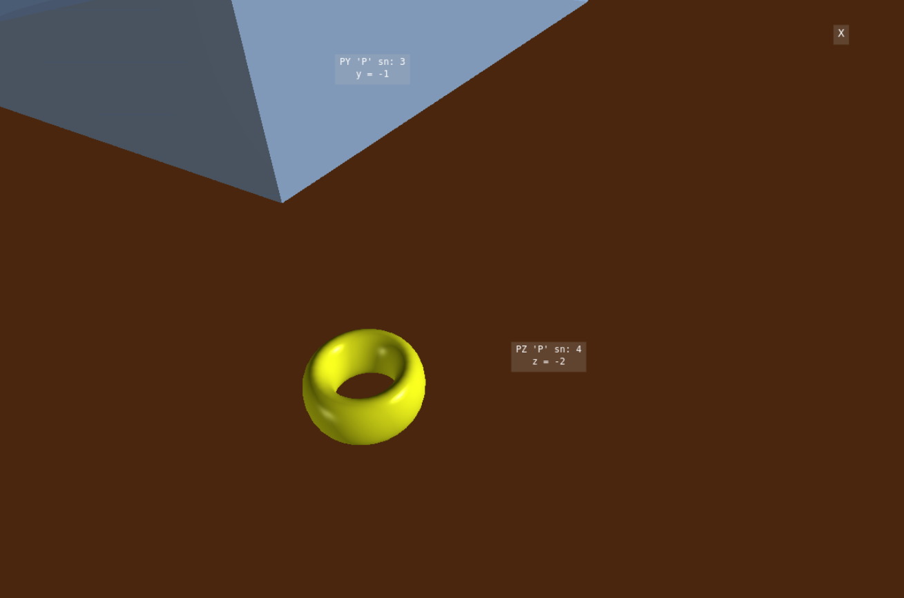

	**Example 1: FitsGeo visualization (ring close shot)**

Starting from line **131**, the part of the code with cell definitions begins. Following code defines "outer void" cell:

.. literalinclude:: examples/example1.py
	:lineno-start: 131
	:lines: 131-132
	:language: python

In this cell transport of all particles stops.

The next part is a bit tricky:

.. literalinclude:: examples/example1.py
	:lineno-start: 134
	:lines: 134-144
	:language: python

To define void cell we need to provide string with intersection of all inner surfaces. At first, we define ``surfaces`` list which contains all inner surfaces. After that, we create empty ``inner_surfaces`` string and loop through all surfaces in ``surfaces`` list to fill this string with intersection of all inner surfaces. And after that, in the line **144** we can finally define void cell as intersection of inner part of ``void`` surface and ``inner_surfaces``. This way we getting cell with space in between of surfaces. It is not necessary to fill this cell with vacuum, we can fill it with air, or, whatever we need.

After that, we need to define cells for inner spaces of surfaces:

.. literalinclude:: examples/example1.py
	:lineno-start: 146
	:lines: 146-153
	:language: python

Here, we can simply define empty ``cells`` list and append it using for loop through surfaces in list. But, this will not work for some of them: cells with ``box_l``, ``box_l`` and ``ball`` surfaces must exclude ``cyl`` surface. Thus, we need to reconfigure cells ``0``, ``1``, ``4`` in ``cells`` list. Again, this is really flexible and not a problem.

The part of code below, shows how we can print all properties of surfaces in console:

.. literalinclude:: examples/example1.py
	:lineno-start: 155
	:lines: 155-158
	:language: python

We use ``created_surfaces`` list for that. Every surface has a ``print_properties`` method, which prints all properties of surface in console.

And the final part exports all defined sections to PHITS:

.. literalinclude:: examples/example1.py
	:lineno-start: 160
	:lines: 160-161
	:language: python

The full code of the PHITS input file, as well as the PHITS visualization, are shown below. Note that the sections exported from FitsGeo are on the **14--68** lines.

.. figure:: images/example1_3D.png
	:align: center
	:figclass: align-center

	**Example 1: PHITS visualization**

.. toggle-header::
	:header: **Example 1: PHITS input**

	.. literalinclude:: examples/example1.inp
		:linenos:
		:emphasize-lines: 14-68
		:language: none	

Example 2(a): Spheres with Hats
===============================

.. rubric:: Illustrative example of FitsGeo usage. Shows how to easily create multiple (repeating) objects

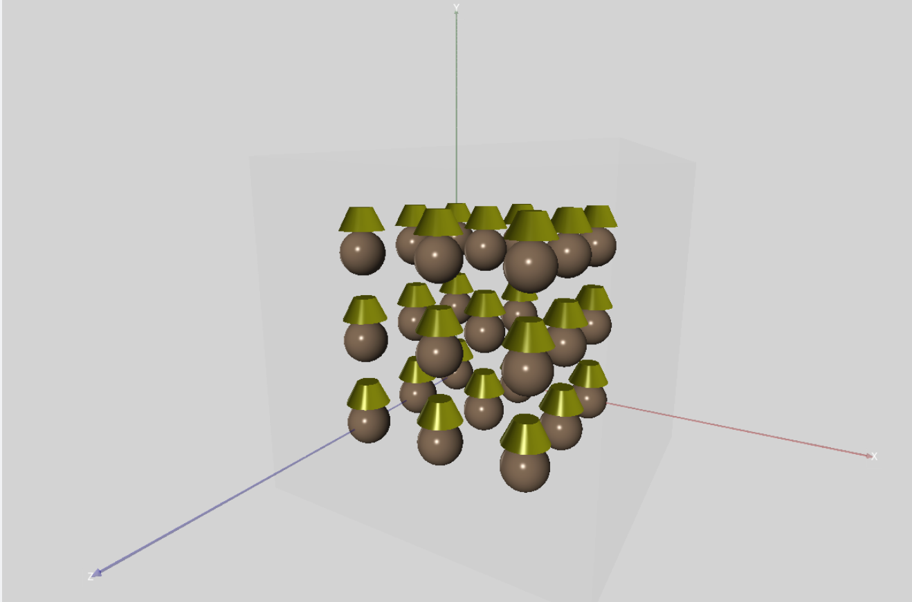

	**Example 2(a): FitsGeo visualization**

In this example, the creation of geometry with multiple (repeating) surfaces using FitsGeo is shown. The visualization in FitsGeo of created geometry is shown in the image above. The full FitsGeo code for this example is shown below.

.. toggle-header::
	:header: **Example 2(a): full FitsGeo code**

	.. literalinclude:: examples/example2a.py
		:linenos:
		:language: python

Like always, the first thing to do is to import FitsGeo:

.. literalinclude:: examples/example2a.py
	:lineno-start: 4
	:lines: 4
	:language: python

Create scene with 10 cm of axes length:

.. literalinclude:: examples/example2a.py
	:lineno-start: 6
	:lines: 6-7
	:language: python

Define 2 materials from predefined databases with ``"yellow"`` and ``"pastelbrown"`` colors for future spheres and "hats":

.. literalinclude:: examples/example2a.py
	:lineno-start: 9
	:lines: 9-11
	:language: python

So, after these preparation steps, let’s say we need some structure with repeating parts. In this example it is spheres and “hats” on top of these spheres. With the help of Python and object-oriented way of geometry development, this will be easy. First, let’s create empty lists for future surfaces and cells and set how many objects we need along each axis:

.. literalinclude:: examples/example2a.py
	:lineno-start: 13
	:lines: 13-17
	:language: python

The next part of code have 3 for loops:

.. literalinclude:: examples/example2a.py
	:lineno-start: 18
	:lines: 18-40
	:language: python

On each step we define one more sphere with hat: surface and cell objects for each of them. Parameters for every new hat are set according to sphere parameters. 

The rest part of the code defines last cell objects for void and “outer void”, draws all surfaces and exports sections to PHITS input. Similarly, we can easily create more repeating objects depending on our needs.

Full PHITS input file and Visualization of geometry via ANGEL are below. The highlighted part of code --- exported sections from FitsGeo.

.. toggle-header::
	:header: **Example 2(a): PHITS input**

	.. literalinclude:: examples/example2a.inp
		:linenos:
		:emphasize-lines: 14-139
		:language: none	

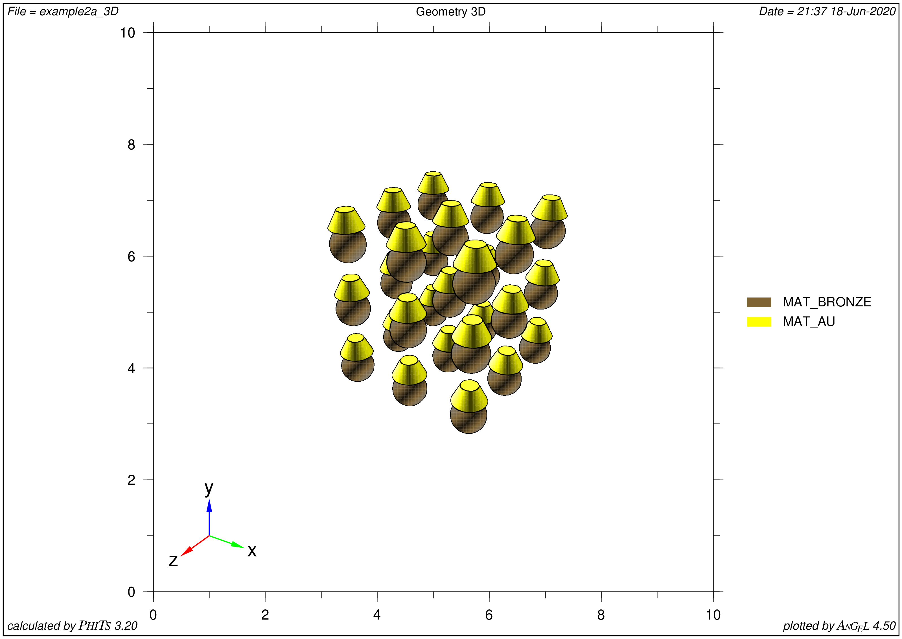

	**Example 2(a): PHITS visualization**

Example 2(b): Snake!
====================

.. rubric:: Illustrative example of FitsGeo usage. Shows how to create multiple (repeating) objects with some math laws

.. figure:: images/fitsgeo_snake.png
	:align: center
	:figclass: align-center

	**Example 2(b): Snake! FitsGeo visualization**

.. toggle-header::
	:header: **Example 2(b): Snake!**

	.. literalinclude:: examples/snake.py
		:linenos:
		:language: python

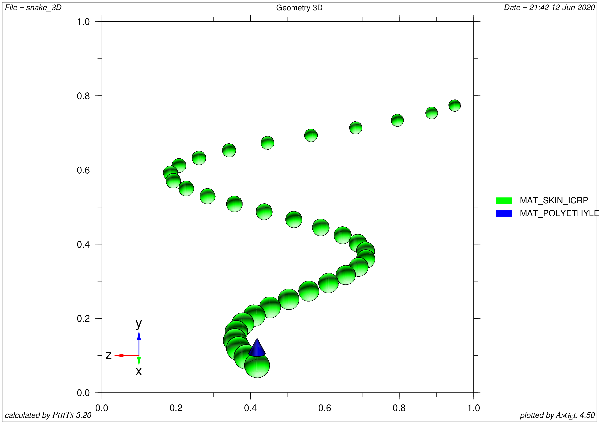

	**Example 2(b): Snake! PHITS visualization**

Example 3: Snowman
==================

.. rubric:: Illustrative example of FitsGeo usage. Shows general workflow of creating complex geometry

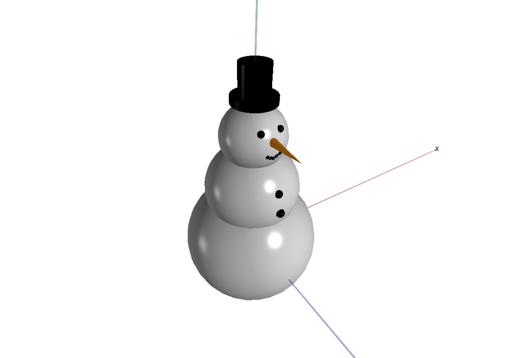

	**Example 3: Snowman. FiotsGeo visualization**

.. toggle-header::
	:header: **Example 3: Snowman**

	.. literalinclude:: examples/snowman.py
		:linenos:
		:language: python

.. figure:: images/snowman_3D.png
	:align: center
	:figclass: align-center

	**Example 3: Snowman. PHITS visualization**

.. .. literalinclude:: examples/example1.py
.. 	:linenos:
.. 	:lineno-start: 3
.. 	:emphasize-lines: 1, 2
.. 	:lines: 3-5
.. 	:language: python			