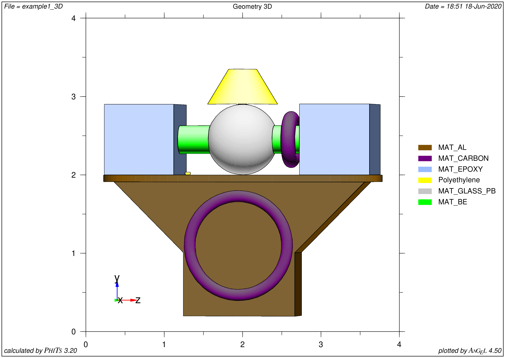
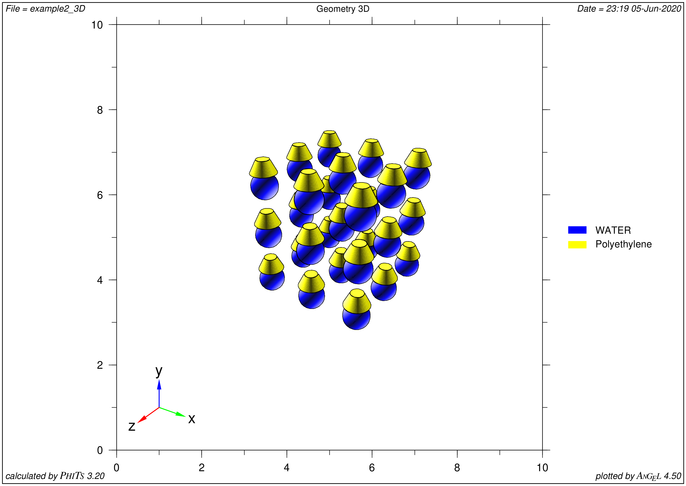
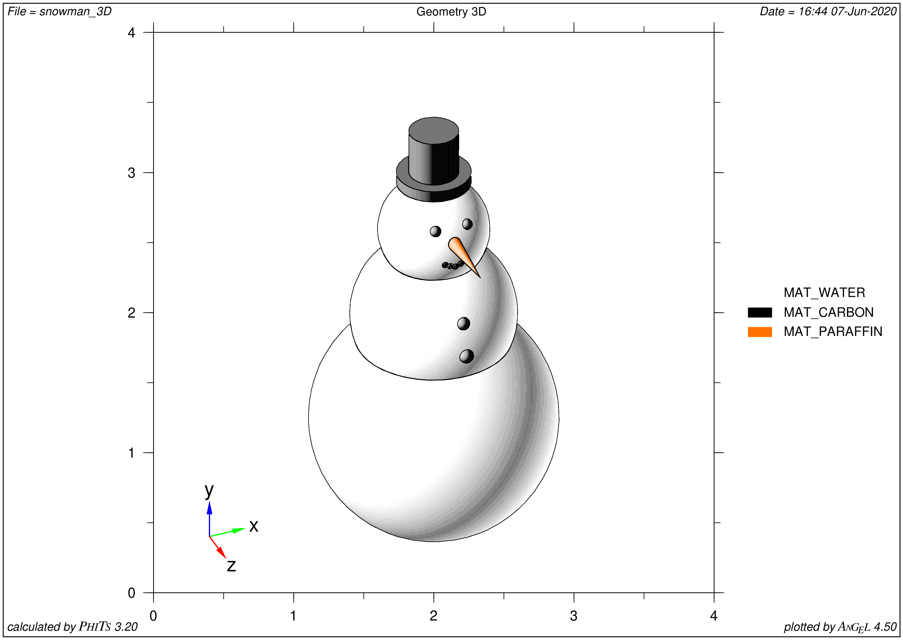

.. highlight:: python

============
User's Guide
============

.. rubric:: Guide covers almost all features and FitsGeo capabilities

Implemented features
====================
.. rubric:: All current implemented capabilities of FitsGeo package

Currently, FitsGeo package have ``surface``, ``const``, ``material`` and ``export`` modules. Each of them responsable for certain tasks:

* ``surface`` consists of classes for defining surfaces
* ``const`` consists of constants used in FitsGeo: colors for surfaces as vpython vectors and ANGEL colors associated to these colors (in Python dictionary), here also some pre-defined materials lay and :math:`\pi` definition from NumPy as math constant
* ``material`` consists of ``Material`` class for material definition 
* ``export`` provides functionality for export of all defined objects to PHITS input (other MC codes can be added in future releases)
  
More modules for other sections of PHITS input will come soon.

Surface module
--------------

Firstly, ``surface`` module have ``list_all_surfaces`` function which prints all implemented surfaces::

	fitsgeo.list_all_surfaces()

Table below show which Python classes for PHITS surfaces are currently implemented. 

+----------------------+------------+--------------------------+---------------+
| PHITS surface symbol |  Type      |      Explanation         | Class in      |
|                      |            |                          | ``surface``   |
+======================+============+==========================+===============+
| P                    |            | multi-purpose            |               |
+----------------------+            +--------------------------+               |
| PX                   |            | vertical with X-axis     |               |
+----------------------+            +--------------------------+               |
| PY                   | planes     | vertical with Y-axis     |      ``P``    |
+----------------------+            +--------------------------+               |
| PZ                   |            | vertical with Z-axis     |               |
+----------------------+------------+--------------------------+---------------+
| SO                   |            | origin is center         |               |
+----------------------+            +--------------------------+               |
| S                    |            | multi-purpose            |               |
+----------------------+            +--------------------------+               |
| SX                   | sphere     | center on X-axis         |               |
+----------------------+            +--------------------------+               |
| SY                   |            | center on Y-axis         |     ``SPH``   |
+----------------------+            +--------------------------+               |
| SZ                   |            | center on Z-axis         |               |
+----------------------+------------+--------------------------+               |
| SPH                  | macro body | same as multi-purpose    |               |
+----------------------+------------+--------------------------+---------------+
| BOX                  | macro body | Optional BOX             |     ``BOX``   |
+----------------------+------------+--------------------------+---------------+
|                      | macro body | Rectangular solid        |               |
| RPP                  |            | (Each surface is vertical|     ``RPP``   |
|                      |            | with x, y, z axes)       |               |
+----------------------+------------+--------------------------+---------------+
| RCC                  | macro body | Cylinder                 |     ``RCC``   |
|                      |            |                          |               |
+----------------------+------------+--------------------------+---------------+
| TRC                  | macro body | Truncated right-angle    |     ``TRC``   |
|                      |            | cone                     |               |
+----------------------+------------+--------------------------+---------------+
| TX                   |            | parallel with X-axis     |               |
+----------------------+            +--------------------------+               |
| TY                   | ellipse    | parallel with Y-axis     |      ``T``    |
+----------------------+ torus      +--------------------------+               |
| TZ                   |            | parallel with Z-axis     |               |
+----------------------+------------+--------------------------+---------------+
| REC                  | macro body | Right elliptical cylinder|     ``REC``   |
+----------------------+------------+--------------------------+---------------+
| WED                  | macro body | Wedge                    |     ``WED``   |
+----------------------+------------+--------------------------+---------------+

Therefore, from each class surface objects can be created. For example, to create box surface object of ``BOX`` class::

	box = fitsgeo.BOX([0, 0, 0], [1, 0, 0], [0, 1, 0], [0, 0, 1], name="Box")

This line creates box object as BOX class at P (0, 0, 0) (base point) coordinate and **A** <1, 0, 0>, **B** <0, 1, 0>, **C** <0, 0, 1> vectors from base point.

Other objects can be created in the same manner. All parameters for all implemented classes listed in the table below.

+----------------------+----------------+--------------------------------------+
| ``surface`` class    | Parameter      | Explanation                          |
+======================+================+======================================+
|                      | ``a: float``   |                                      |
|                      +----------------+                                      |
|                      | ``b: float``   |                                      |
|                      +----------------+ parameters in $Ax + By + Cz - D = 0$ |
|    ``P``             | ``c: float``   | plane equation                       |
|                      +----------------+                                      |
|                      | ``d: float``   |                                      |
|                      +----------------+--------------------------------------+
|                      | ``vert: str``  | axis to which plane                  |
|                      |                | is vertical ("x", "y", "z")          |
+----------------------+----------------+--------------------------------------+
|                      | ``xyz0: list`` | center coordinate of                 |
|                      |                | sphere as list [x0, y0, z0]          |
|   ``SPH``            +----------------+--------------------------------------+
|                      | ``r: float``   | radius of sphere                     |
+----------------------+----------------+--------------------------------------+
|                      | ``xyz0: list`` | base point coordinate                |
|                      |                | as list [x0, y0, z0]                 |
|                      +----------------+--------------------------------------+
|   ``BOX``            | ``a: list``    | vector from base point to            |
|                      |                | first surface as list [Ax, Ay, Az]   |
|                      +----------------+--------------------------------------+
|                      | ``b: list``    | vector from base point to second     |
|                      |                | surface as list [Bx, By, Bz]         |
|                      +----------------+--------------------------------------+
|                      | ``c: list``    | vector from base point to third      |
|                      |                | surface as list [Cx, Cy, Cz]         |
+----------------------+----------------+--------------------------------------+
|                      | ``x: list``    | list with x min and max components   |
|                      |                | as [x_min, x_max]                    |
|                      +----------------+--------------------------------------+    
|  ``RPP``             | ``y: list``    | list with y min and max components   |
|                      |                | as [y_min, y_max]                    |
|                      +----------------+--------------------------------------+
|                      | ``z: list``    | list with z min and max components   |
|                      |                | as [z_min, z_max]                    |
+----------------------+----------------+--------------------------------------+
|                      | ``xyz0: list`` | center coordinate of bottom face     |
|                      |                | as [x0, y0, z0] list                 |
|                      +----------------+--------------------------------------+
|  ``RCC``             | ``h: list``    | vector from the bottom to the top    |
|                      |                | as [Hx, Hy, Hz] list                 |
|                      +----------------+--------------------------------------+
|                      | ``r: float``   | radius of bottom face                |
+----------------------+----------------+--------------------------------------+
|                      | ``xyz0: list`` | center coordinate of cone bottom     |
|                      |                | face as [x0, y0, z0] list            |
|                      +----------------+--------------------------------------+
|                      | ``h: list``    | height vector from center of bottom  |
|  ``TRC``             |                | as [Hx, Hy, Hz] list                 |
|                      +----------------+--------------------------------------+
|                      | ``r_1: float`` | radius of bottom face of             |
|                      |                | truncated cone                       |
|                      +----------------+--------------------------------------+
|                      | ``r_2: float`` | radius of top face of truncated cone |
+----------------------+----------------+--------------------------------------+
|                      | ``xyz0: list`` | center of the torus face             |
|                      |                | as [x0, y0, z0] list                 |
|                      +----------------+--------------------------------------+
|                      | ``r: float``   | distance between xyz0                |
|                      |                | (rotational axis) and ellipse center |
|                      +----------------+--------------------------------------+
|  ``T``               | ``b: float``   | semi-minor axis                      |
|                      |                | (ellipse half "height")              |
|                      +----------------+--------------------------------------+
|                      | ``c: float``   | semi-major axis                      |
|                      |                | (ellipse half "width")               |
|                      +----------------+--------------------------------------+
|                      | ``rot: str``   | rotational axis ("x", "y", "z")      |
+----------------------+----------------+--------------------------------------+
|                      | ``xyz0: list`` | center coordinate of bottom face     |
|                      |                | as [x0, y0, z0] list                 |
|                      +----------------+--------------------------------------+
|                      | ``h: list``    | height vector from center of bottom  |
|                      |                |                                      |
|                      |                | face as [Hx, Hy, Hz] list            |
|   ``REC``            +----------------+--------------------------------------+
|                      | ``a: list``    | semi-major axis vector of ellipse    |
|                      |                | orthogonal to H as [Ax, Ay, Az] list |
|                      +----------------+--------------------------------------+
|                      | ``b: list``    | semi-minor axis vector of ellipse    |
|                      |                | orthogonal to H and A as             |
|                      |                | [Bx, By, Bz] list                    |
+----------------------+----------------+--------------------------------------+
|                      | ``xyz0: list`` | base vertex coordinate               |
|                      |                | as [x0, y0, z0] list                 |
|                      +----------------+--------------------------------------+
|                      | ``a: list``    | vector to first side of triangle     |
|                      |                | as [Ax, Ay, Az] list                 |
|  ``WED``             +----------------+--------------------------------------+
|                      | ``b: list``    | vector to second side of triangle    |
|                      |                | as [Bx, By, Bz] list                 |
|                      +----------------+--------------------------------------+
|                      | ``h: list``    | height vector from base vertex       |
|                      |                | as [Hx, Hy, Hz] list                 |
+----------------------+----------------+--------------------------------------+

Along listed above parameters, each class have common from ``Surface`` super class parameters:

* ``name: str`` --- name for object, for user convenience, appears in commentaries in PHITS input
* ``sn: int`` --- surface object number, automatically set after every new surface initialization, but can be changed manually even after initialization
* ``trn: str`` --- transform number, specifies the number n of TRn from PHTIS [ Transform ] section (in current version transformations not visualizable)
* ``material: fitsgeo.material.Material`` --- material associated with surface, object from ``Material`` class, by default is pre-defined WATER from ``const`` module
* ``color: vpython.vector`` --- vpython.vector object, which defines color for surface (associated with ANGEL color through dictionary from ``const`` module by default)
* ``opacity: float`` --- surface opacity during visualization

Each class have number of getter/setter methods. They define unique for each class properties along parameters from table above: area surfaces, volumes, diameters etc.

For example, to get full surface area of box object::

	area = box.get_full_area

Or, to get volume of box object::

	volume = box.get_volume

To redefine ``xyz0`` parameter of box object::

	box.xyz0 = [1, 2, 3]

To redefine only x component from ``xyz0``::

	box.xyz0[0] = 1

or::

	box.x0 = 1

Similar can be applied to other components and other objects.

In ``SPH`` class all methods represented both as getter and setter methods. This means, that user can define or get any property. For example::

	sphere = fitsgeo.SPH([0, 0, 0], 1)
	sphere.volume = 1

Last line will make ``r`` (radius) parameter correspond to defined volume. Same works for all other methods in ``SPH`` class. To get value::

	volume = sphere.volume

This feature can redefine radius of sphere according to any other defined property. 

Common method for all objects is ``phits_print`` method. This method returns definition of defined object for export to PHITS input file as string::

	phits_definition = box.phits_print()

Material module
---------------

This module have a ``Material`` class. This class defines materials for PHTIS [ Material ] section. ``Material`` class have parameters are:

* ``elements: list`` --- elements in [[A1, Z1, Q1], [A2, Z2, Q2], ...] format, where A --- mass number, Z --- atomic number, Q --- quantity of ratio
* ``name: str`` --- name for material object
* ``ratio_type: str`` --- type of ratio: "atomic" (by default) or "mass"
* ``gas: bool`` --- True if gas (False by default)
* ``color: str`` --- color for material for PHITS ANGEL visualization

Export module
-------------

Module provides functions for export all defined objects to MC code understandable format (only export to PHTIS for now). Example::

	fitsgeo.phits_export()

Will print in console [ Surface ], [ Cell ], [ Material ] sections. By default all sections exported in console, but this may be configured by providing parameters:

* ``export_surfaces: bool`` --- True for export [ Surface ] section
* ``export_materials: bool`` --- True for export [ Material ] section
* ``export_cells: bool`` --- True for export [ Cell ] section
* ``to_file: bool`` --- if True, input file with PHTIS sections will be created
* ``inp_name: str`` --- name for PHITS input file

Example of exporting sections to input file::

	fitsgeo.phits_export(to_file=True, inp_name="example")

Sections can be excluded from export::

	fitsgeo.phits_export(to_file=True, inp_name="example", export_materials=False)

This will export only [ Surface ] and [ Cell ] sections.

Basic example: sphere on box
============================
.. rubric:: Very basic example of how to use FitsGeo

.. todo:: This section not done yet

Example 1: General illustrative example of FitsGeo use
======================================================
.. rubric:: Illustrative example of FitsGeo usage. Covers almost all implemented features.

Start::

	import fitsgeo

	fitsgeo.list_all_surfaces()  # Shows all implemented surfaces

	# Create main scene with axis
	ax_l = 5  # Specify axis length
	scene, ax_x, ax_y, ax_z = fitsgeo.create_scene(ax_length=ax_l)

	# Change scene background
	scene.background = fitsgeo.rgb_to_vector(192, 192, 192)

Example 2: Spheres with Hats
============================

.. rubric:: Illustrative example of FitsGeo usage. Shows how to easily create multiple (repeating) objects

Example 3: Snowman
==================

.. rubric:: Illustrative example of FitsGeo usage. General workflow

Advanced
========

.. literalinclude:: examples/example1.py
	:linenos:
	:lineno-start: 3
	:emphasize-lines: 1, 2
	:lines: 3-5
	:language: python

.. literalinclude:: examples/example2.py
	:linenos:
	:language: python

.. literalinclude:: examples/snowman.py
	:linenos:
	:lines: 1-10
	:language: python
